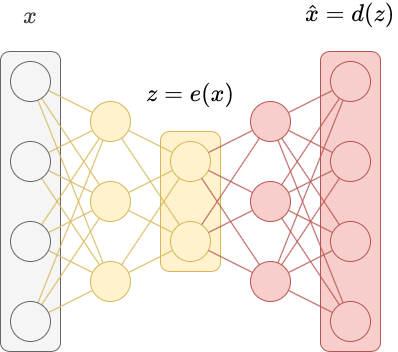
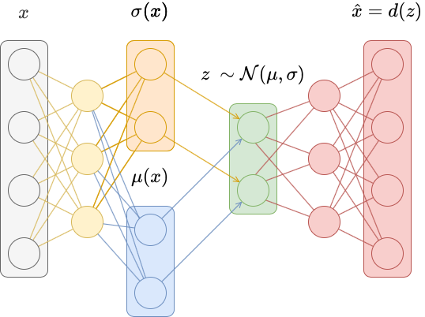

<h1 align='center'> Deep Learning - AE & VAE  🤳 </h1>

Les autoencodeurs sont un type particulier de réseau neuronal non supervisé qui apprend à représenter les données d'entrée dans un espace de dimension réduite (appelé **espace latent**) avant de les reconstruire. 


## **I. Introduction aux Autoencodeurs (AE)**

Il est possible de considérer que les autoencodeurs sont composés de deux réseaux, un **encodeur** $e$ et un **décodeur** $d$.

L'encodeur apprend une transformation non linéaire $e: X$ à $Z$ qui projette les données de l'espace d'entrée original à haute dimension $X$ vers un **espace latent** à plus basse dimension $Z$. Soit $z = e(x)$ un **vecteur latent**. Un vecteur latent est une représentation à faible dimension d'un point de données qui contient des informations sur $x$. La transformation $e$ doit avoir certaines propriétés, comme des valeurs similaires de $x$ doivent avoir des vecteurs latents similaires (et des valeurs dissemblables de $x$ doivent avoir des vecteurs latents dissemblables).

Un décodeur apprend une transformation non linéaire $d: Z$ à $X$ qui projette les vecteurs latents dans l'espace d'entrée original à haute dimension $X$. Cette transformation doit prendre le vecteur latent $z = e(x)$ et reconstruire les données d'entrée originales $\hat{x} = d(z) = d(e(x))$.

Un autoencodeur est simplement la composition du codeur et du décodeur $f(x) = d(e(x))$. L'autoencodeur est entraîné pour minimiser la différence entre l'entrée $x$ et la reconstruction $\hat{x}$ en utilisant une sorte de **perte de reconstruction**. Comme l'autoencodeur est entraîné dans son ensemble (entraîné "de bout en bout"), l'optimisation se fait simultanément sur l'encodeur et le décodeur.


<h3 align='center'>
    
</h3>

<br>

### 1. **Architecture des Autoencodeurs**

Un autoencodeur se compose de deux parties principales:
1. **Encodeur**: 
   - Réduit les données d'entrée dans un espace latent de dimension inférieure.
   - $z = e(x)$, où $z$ est la représentation latente.

2. **Décodeur**:
   - Reconstruit les données d'entrée à partir de la représentation latente.
   - $\hat{x} = d(z)$, où $\hat{x}$ est la reconstruction de $x$.

La tâche de l'autoencodeur est d'optimiser la reconstruction, c'est-à-dire de minimiser la perte entre $x$ et $\hat{x}$.

---

### **Fonction de Perte**

L'objectif est de minimiser la distance entre les données originales $x$ et la reconstruction $\hat{x}$. Typiquement, via la **Mean Squared Error (MSE)** ou la **Binary Cross-Entropy (BCE)** selon les données:
$$\mathcal{L} = \| x - \hat{x} \|^2 \quad \text{(MSE)}$$


<br>


### 2. **Code en PyTorch pour un Autoencodeur**

Voici un exemple d'autoencodeur simple pour les images MNIST:

```python
import torch
import torch.nn as nn
from torchvision import datasets, transforms
from torch.utils.data import DataLoader

# Hyperparamètres
input_dim = 28 * 28
hidden_dim = 128
latent_dim = 32
batch_size = 64
epochs = 10
learning_rate = 1e-3
device = torch.device("cuda" if torch.cuda.is_available() else "cpu")

# Modèle
class Autoencoder(nn.Module):
    def __init__(self):
        super(Autoencoder, self).__init__()
        self.encoder = nn.Sequential(
            nn.Linear(input_dim, hidden_dim),
            nn.ReLU(),
            nn.Linear(hidden_dim, latent_dim),
            nn.ReLU()
        )
        self.decoder = nn.Sequential(
            nn.Linear(latent_dim, hidden_dim),
            nn.ReLU(),
            nn.Linear(hidden_dim, input_dim),
            nn.Sigmoid()  # Pour des données normalisées entre 0 et 1
        )

    def forward(self, x):
        latent = self.encoder(x)
        reconstructed = self.decoder(latent)
        return reconstructed

# Charger les données MNIST
transform = transforms.Compose([
    transforms.ToTensor(),
    transforms.Lambda(lambda x: x.view(-1))  # Aplatir les images
])
dataloader = DataLoader(datasets.MNIST('./data', download=True, transform=transform), batch_size=batch_size, shuffle=True)

# Initialisation
model = Autoencoder().to(device)
optimizer = torch.optim.Adam(model.parameters(), lr=learning_rate)
criterion = nn.MSELoss()

# Entraînement
for epoch in range(epochs):
    for imgs, _ in dataloader:
        imgs = imgs.to(device)
        outputs = model(imgs)
        loss = criterion(outputs, imgs)

        optimizer.zero_grad()
        loss.backward()
        optimizer.step()

    print(f"Epoch [{epoch + 1}/{epochs}], Loss: {loss.item():.4f}")
```

<br>

### 3. **Applications des Autoencodeurs**

1. **Réduction de dimension**:
   - Similaire à PCA, mais **non linéaire**.
2. **Dénoising**:
   - Reconstruction des données propres à partir de données bruitées (*Denoising Autoencoder*).
3. **Compression d'images**:
   - Codage dans un espace latent pour des représentations plus compactes.
4. **Pré-entrainement des réseaux**:
   - Apprentissage des représentations utiles.


<br>
<br>

## **II. Introduction aux Variational Autoencoders (VAEs)**

Un **Variational Autoencoder (VAE)** est une extension probabiliste des autoencodeurs. Il ne se contente pas de compresser les données,  il impose une structure probabiliste à l'espace latent.

La seule contrainte sur la représentation du vecteur latent pour les autoencodeurs traditionnels est que les vecteurs latents doivent être facilement décodables dans l'image originale. En conséquence, l'espace latent $Z$ peut devenir disjoint et non continu. Les autoencodeurs variationnels tentent de résoudre ce problème.

Dans les autoencodeurs traditionnels, les entrées sont mises en correspondance de manière déterministe avec un vecteur latent $z = e(x)$. Dans les autoencodeurs variationnels, les entrées sont mises en correspondance avec une distribution de probabilité sur les vecteurs latents, et un vecteur latent est ensuite échantillonné à partir de cette distribution. Le décodeur devient ainsi plus robuste pour décoder les vecteurs latents. 

Plus précisément, au lieu de mettre en correspondance l'entrée $x$ avec un vecteur latent $z = e(x)$, elle est mise en correspondance avec une distribution de probabilités $p(z|x)$. Pour caractériser cette distribution, une distribution normale est utilisée et le vecteur moyen $\mu(x)$ et un vecteur d'écarts types $\sigma(x)$ sont calculés. Ceux-ci paramètrent une distribution gaussienne diagonale $p(z|x) = \mathcal{N}(\mu_x, \sigma_x)$, à partir de laquelle un vecteur latent $z \sim \mathcal{N}(\mu_x, \sigma_x)$ sera échantilloné.

Pour ce faire, il faut modifier la partie codeur de l'autoencodeur pour qu'elle produise $\mu(x)$ et $\sigma(x)$ dans deux couches distinctes. Une activation exponentielle est souvent ajoutée à $\sigma(x)$ pour s'assurer que le résultat est positif.

<h3 align='center'>
    
</h3>


### 1. **Architecture des VAE**

1. **Encodeur**:
   - Génère deux sorties: la **moyenne** ($\mu$) et la **variance** ($\sigma^2$) d'une distribution latente.
   - $z \sim \mathcal{N}(\mu, \sigma^2)$.

2. **Décodeur**:
   - Reconstruit les données à partir de $z$, échantillonné depuis la distribution latente: $$\hat{x} = d(z)$$


<br>


Toutefois, cela ne résout pas complètement le problème. Il peut toujours y avoir des lacunes dans l'espace latent car les moyennes produites peuvent être significativement différentes et les écarts-types peuvent être faibles. Pour réduire ce problème, il faut ajouter un terme de perte de régularisation qui pénalise la distribution $p(z \mid x)$ pour être trop éloignée de la distribution normale standard $\mathcal{N}(0, 1)$. 

Ce terme de pénalisation est la [divergence de KL](https://fr.wikipedia.org/wiki/Divergence_de_Kullback-Leibler) entre $p(z \mid x) = \mathcal{N}(\mu_x, \sigma_x)$ et $\mathcal{N}(0, 1)$, qui est donnée par
$$\mathcal{L}_{KL} = D_{KL}(q(z|x) \| p(z)) = \frac{1}{2} \sum \left( 1 + \log(\sigma^2) - \mu^2 - \sigma^2 \right)$$
Cela permet de **contraindre la distribution latente à être proche d'une gaussienne standard**. En substance, il faut forcer le codeur à trouver des vecteurs latents qui suivent approximativement une distribution gaussienne standard que le décodeur peut alors décoder efficacement.

Il faut de plus, ajouter une **erreur de reconstruction** à la perte. Soit la similarité entre $x$ et $\hat{x}$:
   $$\mathcal{L}_{reconstruction} = \| x - \hat{x} \|^2$$
   

#### La perte totale est donc:
$$\mathcal{L} = \mathcal{L}_{reconstruction} + \mathcal{L}_{KL}$$
$$\mathcal{L} = \| x - \hat{x} \|^2 + \frac{1}{2} \sum \left( 1 + \log(\sigma^2) - \mu^2 - \sigma^2 \right)$$


<br>

### 2. **Code en PyTorch pour un VAE**


```python
class VAE(nn.Module):
    def __init__(self, input_dim, hidden_dim, latent_dim):
        super(VAE, self).__init__()
        self.encoder = nn.Sequential(
            nn.Linear(input_dim, hidden_dim),
            nn.ReLU()
        )
        self.mu = nn.Linear(hidden_dim, latent_dim)
        self.log_var = nn.Linear(hidden_dim, latent_dim)
        self.decoder = nn.Sequential(
            nn.Linear(latent_dim, hidden_dim),
            nn.ReLU(),
            nn.Linear(hidden_dim, input_dim),
            nn.Sigmoid()
        )

    def reparameterize(self, mu, log_var):
        std = torch.exp(0.5 * log_var)
        eps = torch.randn_like(std)
        return mu + eps * std

    def forward(self, x):
        h = self.encoder(x)
        mu = self.mu(h)
        log_var = self.log_var(h)
        z = self.reparameterize(mu, log_var)
        reconstructed = self.decoder(z)
        return reconstructed, mu, log_var

# Initialisation
vae = VAE(input_dim, hidden_dim, latent_dim).to(device)
optimizer = torch.optim.Adam(vae.parameters(), lr=learning_rate)

# Entraînement
for epoch in range(epochs):
    for imgs, _ in dataloader:
        imgs = imgs.to(device)
        reconstructed, mu, log_var = vae(imgs)

        # Pertes
        reconstruction_loss = nn.MSELoss()(reconstructed, imgs)
        kl_divergence = -0.5 * torch.sum(1 + log_var - mu.pow(2) - log_var.exp())
        loss = reconstruction_loss + kl_divergence

        optimizer.zero_grad()
        loss.backward()
        optimizer.step()

    print(f"Epoch [{epoch + 1}/{epochs}], Loss: {loss.item():.4f}")
```

Les autoencodeurs variationnels produisent un espace latent $Z$ qui est régularisé pour être plus compact et plus lisse que celui appris par les autoencodeurs traditionnels. Cela permet d'échantillonner au hasard des points $z \sim Z$ et de produire des reconstructions correspondantes $\hat{x} = d(z)$ qui forment des chiffres réalistes, contrairement aux autoencodeurs traditionnels.

---

### 3. **Applications des VAE**

1. **Génération de données**: 
   - Produire des images ou des échantillons similaires aux données d'entrée.
2. **Modélisation de la distribution latente**:
   - Capturer une distribution probabiliste sur les données.
3. **Interpolations**:
   - Créer des transitions fluides entre des points dans l'espace latent.
4. **Réduction de dimension**:
   - Identifier des structures sous-jacentes dans les données.


<br>
<br>

## III. Résumé des Différences entre AE et VAE

| **Autoencodeurs (AE)** | **Variational Autoencoders (VAE)** |
|-------------------------|-----------------------------------|
| Latent space déterministe | Latent space probabiliste |
| Optimise uniquement la reconstruction | Ajoute une régularisation via divergence KL |
| Non probabiliste | Probabiliste, capable de générer des données nouvelles |