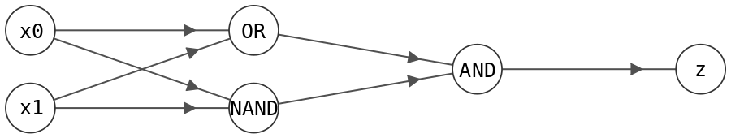
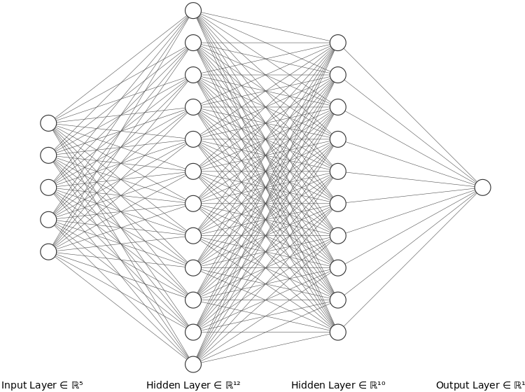
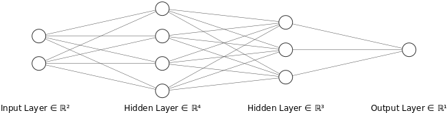

<h1 align='center'> Deep learning - Artificial Neural Networks 🧠</h1>


## I. Réseaux neuronaux biologiques
Dans les années 1830, la théorie cellulaire est introduite, démontrant que les organismes vivants sont composés de cellules. 
Cependant, à cause des limites des microscopes de l'époque, personne n'avait encore observé les constituants de base des tissus nerveux, 
faisant du système nerveux une exception à la théorie cellulaire.   

En 1888, *Santiago Ramón y Cajal* observe une séparation physique entre les cellules individuelles à la jonction axone/dendrite (chez les poulets), 
jetant ainsi les bases de la doctrine neuronale. Cette découverte lui vaut le prix Nobel de physiologie ou médecine en 1906.   

La doctrine neuronale postule que:
- les neurones sont les unités de base du système nerveux,
- les dendrites, le noyau, l'axone et les synapses sont les composantes principales des neurones,
- les impulsions électriques et les neurotransmetteurs chimiques jouent un rôle crucial dans la transmission des informations dans le système nerveux.

<br>

## II. Réseaux neuronaux artificiels

L'idée général d'un réseau de neurones est que:
1. Chaque neurone traite une partie de l'information et la transmet à ses "enfants".
2. Dans l'ensemble, le réseau transforme des informations brutes en concepts généraux.

Est-ce alors possible d'imiter ce système de connexions dans un système d'apprentissage qui adapte ses paramètres en fonction des données auxquelles il est exposé?

### 1. Histroire des réseaux de neurones aritificiels
En s'inspirant du neurone biologique, un modèle simplifié de neurone a été construit. En supposant qu’un signal d’entrée soit représenté par un vecteur binaire $x$. Les éléments de $x$ peuvent représenter des énoncés binaires (ex: "il pleut", "j'ai un parapluie"...). L’**activation** d’un neurone fut modélisé comme suit:
$f(x)=\left\{\begin{array}{ll} 0 & \textrm{si }w^T x+b\leq 0 \\ 1 & \textrm{sinon}\end{array}\right.=step\left(w^Tx + b\right)$,
où $step$ est la fonction échelon de Heaviside.  

Cette fonction est un *Perceptron de Rosenblatt*. Le perceptron de Rosenblatt est la fonction $step(w_1 x_1 + w_2 x_2 + b)$.   
Essentiellement, un perceptron est une **règle de séparation linéaire**.  
Intuitivement, c’est une machine qui pondère les éléments de preuve $x$ et les compare à un seuil $b$ pour prendre une décision $f(x)$.


<br>

Avec $(w_1, w_2, b) = (2,2,-1)$, c'est une porte **OR**.  

Avec $(w_1, w_2, b) = (2,2,-3)$, c'est une porte **AND**.  

Avec $(w_1, w_2, b) = (-2,-2,3)$, c'est une porte **NAND**.  


```python
import numpy as np

def perceptron(w,b,x):
    return np.heaviside(np.dot(x,w)+b,0)

x = np.zeros((4,2))
x[1,0] = 1.
x[2,1] = 1.
x[3,0] = 1.
x[3,1] = 1.

print("input values:\n", x)

def OR(x):
    w = np.array([2.,2.])
    b = -1.
    return perceptron(w,b,x)
print("testing OR gate:", OR(x))

def AND(x):
    w = np.array([2.,2.])
    b = -3.
    return perceptron(w,b,x)
print("testing AND gate:", AND(x))

def NAND(x):
    w = np.array([-2.,-2.])
    b = 3.
    return perceptron(w,b,x)
print("testing NAND gate:", NAND(x))
```
*<u> Remarque:</u> Un perceptron est invariant par multiplication scalaire.*   

**Mais**, il n'est pas possible de modéliser une porte **XOR** par un perceptron. Étant donné que les perceptrons mettent en œuvre un seuil sur une combinaison linéaire des entrées, ils ne peuvent séparer que les classes qui sont **linéairement séparables**. Or le XOR est un exemple typique de données non linéairement séparables.   

<br>

**Cependant**, il est possible de connecter des perceptrons ensemble pour obtenir une fonction XOR (par exemple, en remarquant que: $Z=$ $x_0$ XOR $x_1$ = $[(x_0$ OR $x_1)$ AND $(x_0$ NAND $x_1)]$.   

<h3 align='center'>
    </img>
</h3>


En réalité, il est possible de procéder ainsi pour **toute fonction logique**.    
De telles architectures connectées sont appelées **Perceptrons Multi-Couches (MLP)**. Ce terme a ensuite été utilisé (abusivement) pour désigner des réseaux multi-couches de neurones artificiels, quelle que soit leur fonction d'activation.  
Par conséquent, tout circuit logique peut être représenté sous la forme d'un MLP.


### 2. Réseaux de neurones aritificiels

Un réseau neuronal est obtenu en connectant les sorties de certains neurones aux entrées d'autres neurones. Le but d'un tel réseau est généralement d'apprendre à imiter une certaine fonction $f(x)$ pour laquelle on dispose de paires de données d'entraînement $(x,y)$ avec $y = f(x) + \textrm{bruit}$. Ainsi, un tel réseau contient trois types de neurones:
- **Neurones d'entrée:** Correspondent aux différentes variables d'entrée $x_j$ décrivant les exemples d'entraînement.
- **Neurones de sortie:** Correspondent aux cibles $y$ des exemples.
- **Neurones cachés:** Tout neurone qui n'est ni un neurone d'entrée ni un neurone de sortie.

Un réseau neuronal est donc un graphe de calcul, avec des entrées $x$ et des sorties $y$, où les nœuds sont des neurones et les arêtes connectent la sortie d'un nœud à l'une des entrées d'un autre.

Une **couche** est un ensemble maximal de neurones non connectés, situés à la même profondeur depuis la couche d'entrée.   
Un réseau neuronal organisé en couches est appelé un **réseau neuronal à propagation avant** (*feedforward NN*).   
Certains réseaux neuronaux ne sont pas des réseaux à propagation avant et contiennent des boucles. Ils sont appelés **réseaux neuronaux récurrents** (*Recurrent NN*).   
Un réseau neuronal multicouche est souvent appelé **perceptron multicouche** (pour des raisons historiques).

<h3 align='center'>
    </img>
</h3>


La sortie d'un neurone résulte de l'application de la *fonction d'activation* $\sigma$ à une combinaison linéaire de ses entrées: $z = \sigma(w^T x + b)$.   
Les paramètres du réseau sont **tous les poids d'entrée et biais des neurones**.     
Un réseau neuronal est une fonction qui transforme ses entrées en sorties par propagation des valeurs dans le réseau.   
Apprendre un réseau neuronal consiste à trouver les $w$ et $b$ pour que la sortie du réseau corresponde à la fonction $f(x)$ qui a généré les paires de données $(x, y = f(x)+\textrm{bruit})$.


#### **Théorème d'approximation universelle:**  
Si $\sigma$ est "en forme de S", alors avec suffisamment de neurones, un réseau neuronal à une seule couche et à propagation avant peut approximer n'importe quelle fonction continue avec une précision arbitraire.  


#### **Fonctions d'activation:**
Historiquement, il a été considéré une activation stricte en "0 ou 1" pour un certain neurone. Mais si l'entrée $x$ n'est plus binaire, lors du traitement de $x$, soit la stimulation du neurone $w^Tx$ est supérieure à $-b$, soit elle y est inférieure. Cela rend la sortie d'un neurone très sensible au bruit dans l'entrée ou aux erreurs dans le réglage des poids.   
À l'inverse, il faudrait définir une fonction qui soit en forme de **S**, et qui passe **progressivement** de 0 à 1.   
- **Fonction "step":**  
$$\sigma(x) = 0 \textrm{ si }x\leq0, \, 1 \textrm{ sinon}$$
- **Fonction linéaire:**  
$$\sigma(x) = x$$
- **Sigmoïde (logistique):**  
$$\sigma(x) = \frac{1}{1 + e^{-x}}$$
- **Tangente hyperbolique:**  
$$\sigma(x) = \frac{e^{x} - e^{-x}}{e^{x} + e^{-x}}$$
- **Fonction de base radiale:** (utile dans des cas spécifiques, comme les cartes de Kohonen)  
$$\sigma(x) = e^{-x^2}$$


<br>

## III. Propagation des valeurs à travers un réseau

Soit un réseau neuronal avec la structure suivante:
- 2 neurones d'entrée.
- Une première couche cachée composée de 4 neurones sigmoïdes.
- Une seconde couche cachée composée de 3 neurones sigmoïdes.
- Une couche de sortie composée d'un neurone d'identité.


<h3 align='center'>
    </img>
</h3>

Pour l'instant les poids seront initialisés de manière aléatoire, en suivant une distribution $\mathcal{N}(0,1)$.

```python
sizes = [2,4,3,1]
num_layers = len(sizes)
biases = [np.random.randn(1,y) for y in sizes[1:]]
weights = [np.random.randn(out,inp) for inp,out in zip(sizes[:-1],sizes[1:])]

def sigmoid(z):
    """The sigmoid function."""
    return 1.0/(1.0+np.exp(-z))
``` 


La fonction qui calcule la propagation vers l'avant d'une entrée donnée (ex: $x=[1,2]$) à travers le réseau est donné par:
```python
import numpy as np

input_value = np.array([[1,2]])

def forward_pass(x, verbose=False):
    z = [np.zeros((x.shape[0], sz)) for sz in sizes]
    y = [np.zeros((x.shape[0], sz)) for sz in sizes]
    z[0] = x.copy()

    for i in range(1, len(sizes)):
        if verbose:
            print("# Forward propagation to layer", i)
        y[i] = np.dot(z[i - 1],weights[i - 1].T) + biases[i - 1]

        if verbose:
            print("Neuron inputs:", y[i])

        if i == len(sizes) - 1:
            z[i] = y[i]

        else:
            z[i] = sigmoid(y[i])

        if verbose:
            print("Layer outputs:", z[i])

    return y, z

y, z = forward_pass(input_value, verbose=True)
print(y, z)
``` 

<br>

### IV. Apprentissage des poids d'un réseau neuronal (cas de régression)
Il faut désormais adapter les poids du réseau de manière à ce que lors de la propagation d'une entrée $x$, la prédiction soit au plus proche de $y$. 

>   *Ex: Si la valeur associée à $x = [1,2]$ dans l'exemple précédent soit $y_{true} = 12.3$, la prédiction étant $y_{pred} = 0.46081774$, il faut ajuster les poids du réseau de manière à ce que, la prochaine fois que $x$ est propagé à travers le réseau, la prédiction soit plus proche de $12.3$.*


Supposons tout d'abord que nos points de données $(x,y)$ sont tirés d'une distribution de probabilité $p(x,y)$.

#### 1. Minimisation du risque et fonctions de perte

Un réseau neuronal avec une structure de graphe fixe est une fonction paramétrique $f_\theta$, où $\theta$ est le **vecteur de tous les paramètres (poids et biais).**  
Apprendre un réseau neuronal qui prédit correctement $y$ revient à trouver les paramètres $\theta$ qui minimisent la fonction suivante:  
$$L(\theta) = \displaystyle \mathbb{E}_{(x,y)\sim p(x,y)} \left[ \left(f_\theta(x) - y\right)^2 \right] = \int_{x,y} \left[ \left(f_\theta(x) - y\right)^2 \right] \mathrm{d}p(x,y) $$

Cela définit un problème de minimisation des moindres carrés. 

La **minimisation du risque** revient donc à trouver $f^{*} \in \arg\min_{f \in \mathcal{F}} L(f)$, où $\mathcal{F}$ est une famille de fonctions. Dans le cas présent, puisque la structure du réseau est fixe, cette famille correspond aux fonctions générées en faisant varier les paramètres $\theta$.  

Cependant, en pratique, calculer le risque est impossible car $p(x,y)$ est inconnue. En apprentissage supervisé, on utilise des ensembles d'entraînement $\{(x_i,y_i)\}_{i\in [1,N]}$ où les points sont indépendants et tirés selon $p(x,y)$. L'ensemble d'entraînement permet de définir une mesure empirique $\bar{p}(x,y)$, et on peut approximer le risque par le **risque empirique**:  
$$\bar{L}(f) = \mathbb{E}_{(x,y)\sim \bar{p}(x,y)} \left[ \ell(f(x),y) \right] = \frac{1}{N} \sum_{i=1}^N \ell(f(x_i),y_i).$$

Le risque empirique est une estimation de Monte Carlo du risque, basée sur l'ensemble d'entraînement. Cette généralisation est le principe de base de la **minimisation du risque empirique**, qui sous-tend l'optimisation des réseaux neuronaux.

```python
ypred, zpred = forward_pass(input_X, verbose=True)
pred = zpred[-1]
err = np.mean((pred - output_y)**2)
print("Empirical risk estimate:", err)
```


#### 2. Descente de gradient stochastique

Soit une estimation initiale $\theta_0$ pour les paramètres de $f_\theta$. Comment ajuster cette estimation pour minimiser $L(\theta)$? La descente de gradient directe indique de se déplacer dans la direction opposée du gradient de $L(\theta)$ par rapport à $\theta$. Écrivons ce gradient:

$$\nabla_\theta L(\theta) = \nabla_\theta \left[ \mathbb{E}_{(x,y)\sim p(x,y)} \left[ \left(f_\theta(x) - y\right)^2 \right] \right]$$


$$\nabla_\theta L(\theta) = \mathbb{E}_{(x,y)\sim p(x,y)} \left[ \nabla_\theta \left[ \left(f_\theta(x) - y\right)^2 \right] \right]$$


$$\nabla_\theta L(\theta) = \mathbb{E}_{(x,y)\sim p(x,y)} \left[ 2 \left(f_\theta(x) - y\right) \nabla_\theta f_\theta(x) \right]$$

Ainsi, le gradient de $L(\theta)$ est l'espérance de $2 \left(f_\theta(x) - y\right) \nabla_\theta f_\theta(x)$. En d'autres termes:

$$\nabla_\theta L(\theta) = \int_{x,y} 2 \left(f_\theta(x) - y\right) \nabla_\theta f_\theta(x) \mathrm{d}p(x,y)$$

Le problème avec cette expression est qu'elle nécessite la connaissance de $p(x,y)$ pour tous les couples $(x,y)$ possibles (comme pour le calcul du risque). Cela nécessiterait une quantité infinie de données. Cependant, il est possible d'essayer de substituer le risque par le risque empirique et approximer ce gradient avec un ensemble de données fini $\left\{\left(x_i,y_i\right)\right\}_{i\in [1,N]}$ tiré indépendamment selon $p$:  
$$\nabla_\theta L(\theta) \approx \nabla_\theta \bar{L}(\theta) = \frac{1}{N}\sum_{i=1}^N 2 \left(f_\theta(x_i) - y_i\right) \nabla_\theta f_\theta(x_i)$$

Ceci est en fait une *estimation bruyante du gradient* (qui converge vers le vrai gradient dans le cas d'un échantillonnage infini).  
La théorie de la *descente de gradient stochastique* indique que si $g(\theta)$ est une estimation bruyante du gradient $\nabla_\theta L(\theta)$, alors la séquence $\theta_k$ converge vers un minimum local de $L(\theta)$:  
$$\theta_{k+1} = \theta_k - \alpha_k g(\theta_k)$$  
sous la condition que $\sum \alpha_k = \infty$ et $\sum \alpha_k^2 < \infty$ (conditions de Robbins-Monro).

La première condition $\sum \alpha_k = \infty$ garantit que, quel que soit le point de départ des paramètres $\theta_0$, peu importe la distance du minimum, cette procédure peut l'atteindre.  

La seconde condition $\sum \alpha_k^2 < \infty$ force les pas d'apprentissage à être une séquence décroissante et évite les oscillations autour du minimum.
 
$$g(\theta) = \frac{1}{N} \sum_{i=1}^N 2 \left(f_\theta(x_i) - y_i\right) \nabla_\theta f_\theta(x_i).$$


Un passage complet (pour calculer le $\sum_{i=1}^N$) sur l'ensemble de l'entraînement sera appelé une *époque d'entraînement* (**epoch**).


#### 3. Mini-batch

Clarification de la notation: 

Il est possible de calculer:
$$g_{j}(\theta) = \frac{1}{N} \sum_{i=1}^N 2 \left(f_{\theta}(x_i) - y_i\right) \frac{\partial f_{\theta}}{\partial\theta_j}(x_i)$$
Et ainsi, il est possible de mettre à jour $\theta_j$ avec:
$$\theta_j \leftarrow \theta_j - \alpha_k g_{j}(\theta)$$

*<u>Remarque:</u> $\theta_k$ fait référence au $k$-ème vecteur de paramètres dans la séquence ci-dessus, $\theta_j$ fait référence au $j$-ème composant du vecteur $\theta$.*

Ainsi, le calcul de tous les composants de $g(\theta)$ et la mise à jour de chaque élément de $\theta$ peuvent être effectués en *parallèle*.

Cependant, pour de grands ensembles de données, la sommation sur les $N$ éléments est coûteuse sur le plan computationnel.  

L'écart type de la moyenne empirique sur $n$ échantillons i.i.d. d'une variable aléatoire $X$ est $\frac{\sigma}{\sqrt{n}}$, où $\sigma$ est l'écart type de la loi de $X$.
</details>

Ainsi, il est possible de définir une version moins coûteuse (mais plus bruyante) de l'estimateur du gradient en sommant seulement sur un sous-ensemble aléatoire de $n$ points d'entraînement ($n \ll N$): 
$$\nabla_\theta L(\theta) \approx g(\theta) = \frac{1}{n} \sum_{i=1}^n 2 \left(f_\theta(x_i) - y_i\right) \nabla_\theta f_\theta(x_i) $$

Un tel sous-ensemble est appelé un *minibatch*. Lorsque $n=1$, l'estimateur du gradient est basé sur un seul exemple et est donc très bruyant et la convergence peut être très lente et instable. Lorsque $n\rightarrow N$, le niveau de bruit diminue au prix d'un coût computationnel plus élevé. En pratique, le niveau de bruit diminue suffisamment rapidement pour qu'il soit soit possible de prendre $n \in [50;1000]$ dans la plupart des cas.

En général, des mini-batchs de taille fixe sont pris et le terme $\frac{1}{n}$ est omis dans l'estimation du gradient: il se fond avec le pas de l'apprentissage $\alpha_k$, appelé également **taux d'apprentissage**.


#### 4. Calcul de gradient récursif

Pour que la mise à jour décrite soit faisable, il est nécessaire d'avoir une fonction $f_\theta$ différentiable. Soit $\nabla_\theta f_\theta(x)$:
$$\nabla_\theta f_\theta(x) = \left[ \begin{array}{c} \vdots \\ \frac{\partial f_\theta}{\partial \theta_j}(x) \\ \vdots \end{array} \right]$$

Soit le neurone $j$ et $w_{ij}$ ses poids d'entrée (avec la convention que $i=0$ correspond au biais):
- $x_{ij}$ l'entrée $i$-ème de ce neurone
- $y_j = \sum_i w_{ij} x_{ij}$ l'entrée scalaire à la fonction d'activation
- $z_j = \sigma(y_j)$ la sortie du neurone

Ces trois quantités ont été calculées lors du *passage avant*, lorsque $x$ a été propagé à travers le réseau pour obtenir $f_\theta(x)$.

En utilisant la règle de la chaîne pour écrire $\frac{\partial f_\theta}{\partial w_{ij}}(x)$ comme une expression des dérivées partielles de $f_\theta$ par rapport à $z_j$ et $y_j$:
$$\frac{\partial f_\theta}{\partial w_{ij}}(x) = \frac{\partial f_\theta}{\partial z_j}(x) \frac{\partial z_j}{\partial y_j}(x) \frac{\partial y_j}{\partial w_{ij}}(x)$$

Or $y_j = \sum_i w_{ij} x_{ij}$, donc:
$$\frac{\partial y_j}{\partial w_{ij}}(x) = x_{ij}$$

$z_j = \sigma(y_j)$, donc:
$$\frac{\partial z_j}{\partial y_j}(x) = \sigma'(y_j)$$

Et donc:
$$\boxed{\frac{\partial f_\theta}{\partial w_{ij}}(x) = \frac{\partial f_\theta}{\partial z_j}(x) \sigma'(y_j) x_{ij}}$$

Il reste à calculer le premier terme dans l'expression ci-dessus.   
**<u>Cas 1:</u>** $j$ est un neurone de sortie, alors $z_j$ est le $j$-ème composant de $f_\theta(x)$, et donc:
$$\frac{\partial f_\theta}{\partial z_j}(x) = 1$$

En conséquence, pour les neurones de la couche de sortie:
$$\boxed{\frac{\partial f_\theta}{\partial w_{ij}}(x) = \sigma'(y_j) x_{ij}}$$

Et donc, la mise à jour des poids d'entrée $w_{ij}$ pour le neurone de sortie $j$ (dans la couche de sortie) est:
$$w_{ij} \leftarrow w_{ij} - \alpha \left(f_\theta(x) - y\right)\sigma'(y_j) x_{ij}$$


**<u>Cas 2:</u>**  $j$ est un neurone de la couche juste avant la couche de sortie.   
Soit $L_j$ l'ensemble des indices des neurones qui alimentent directement la sortie du neurone $j$. $z_j$ correspond à la variable $x_{jl}$ pour ces neurones et $y_l$ est l'entrée scalaire du neurone $l$.

En prenant la dérivée totale:
$$\frac{\partial f_\theta}{\partial z_j}(x) = \sum_{l \in L_j} \frac{\partial f_\theta}{\partial y_l}(x) \frac{\partial y_l}{\partial z_j}(x)$$

Alors:
$$\frac{\partial f_\theta}{\partial z_j}(x) = \sum_{l \in L_j} \frac{\partial f_\theta}{\partial z_l}(x) \frac{\partial z_l}{\partial y_l}(x) \frac{\partial y_l}{\partial z_j}(x)$$

Comme précédemment:
$$\frac{\partial z_l}{\partial y_l}(x) = \sigma'(y_l) \text{ et } \frac{\partial y_l}{\partial z_j}(x) = w_{jl}$$

Donc cette dérivée totale devient:
$$\boxed{\frac{\partial f_\theta}{\partial z_j}(x) = \sum_{l \in L_j} \frac{\partial f_\theta}{\partial z_l}(x) \sigma'(y_l) w_{jl}}$$

Cela fournit une relation de récurrence entre $\frac{\partial f_\theta}{\partial z_j}(x)$ et $\frac{\partial f_\theta}{\partial z_l}(x)$ pour $l \in L_j$.

Soit $\delta_j = \frac{\partial f_\theta}{\partial z_j}(x) \sigma'(y_j)$:
$$\frac{\partial f_\theta}{\partial w_{ij}}(x) = \frac{\partial f_\theta}{\partial z_j}(x) \frac{\partial z_j}{\partial y_j}(x) \frac{\partial y_j}{\partial w_{ij}}(x) = \frac{\partial f_\theta}{\partial z_j}(x) \sigma'(y_j) x_{ij} = \delta_j x_{ij},$$
$$\boxed{\frac{\partial f_\theta}{\partial w_{ij}}(x) = \delta_j x_{ij}}$$

Grâce à l'équation de récurrence entre le neurone $j$ et ses frères dans $L_j$:
$$\delta_j = \frac{\partial f_\theta}{\partial z_j}(x) \sigma'(y_j) = \sigma'(y_j) \sum_{l \in L_j} \delta_l w_{jl}$$

Et, en particulier, pour les neurones de sortie:
$$\delta_j = \frac{\partial f_\theta}{\partial z_j}(x) \sigma'(y_j) = \sigma'(y_j)$$

En résumé:
$$\boxed{\delta_j = \left\{ \begin{array}{ll}
\sigma'(y_j) & \text{pour les neurones de sortie,} \\
\sigma'(y_j) \sum_{l \in L_j} \delta_l w_{jl} & \text{pour les autres neurones.}
\end{array} \right.}$$


#### 5. Backpropagation

La clé de la rétropropagation est de remarquer que dans tous les cas:
$$\frac{\partial f_\theta}{\partial w_{ij}}(x) = \delta_j x_{ij}$$

Si le neurone $j$ est un neurone de sortie, alors $z_j$ est le $j$-ème composant de $f_\theta(x)$. Ainsi, $\frac{\partial f_\theta}{\partial z_j}(x) = 1$. En conséquence, pour ces neurones:
$$\delta_j = \frac{\partial f_\theta}{\partial z_j}(x) \sigma'(y_j) = \sigma'(y_j)$$

Récursivement, une fois que tous les $\delta_j$ pour la couche de sortie ont été calculés, il est possible de calculer les $\delta_j$ pour la dernière couche cachée:
$$\delta_j = \sigma'(y_j) \sum_{l \in L_j} \delta_l w_{jl}$$

Et les poids d'entrée du neurone $j$ peuvent être mis à jour:
$$w_{ij} \leftarrow w_{ij} - \alpha \left(f_\theta(x) - y\right) \delta_j x_{ij}$$

Une fois que tous ces poids ont été mis à jour et que tous les $\delta_j$ ont été calculés pour les neurones correspondants, il est possible d'avancer une couche en arrière dans le réseau, et ainsi de suite jusqu'à atteindre la couche d'entrée.

Cet algorithme est appelé *rétropropagation* (**backpropagation**) du gradient. La rétropropagation permet au réseau d'apprendre comment ajuster les poids en fonction de l'erreur, optimisant ainsi la performance du modèle sur les données d'entraînement.


<br>

L'algorithme de rétropropagation permet de mettre à jour les poids du réseau.

**Propagation avant:**
<ol style="list-style-type:none">

- Entrée $x$
- $\lambda =$ couche d'entrée
- Tant que $\lambda \neq$ couche de sortie:
  <ol style="list-style-type:none">

    - Pour $j$ dans $\lambda$:   
      -> Calculer $y_j = \sum w_{ij} x_{ij}$ et $z_j = \sigma(y_j)$
    - $\lambda \leftarrow$ couche suivante
    - $x \leftarrow z$
  </ol>

- Sortie $f_\theta(x)$
</ol>

**Rétropropagation:**
<ol style="list-style-type:none">

- Différence de la sortie $\Delta = f_\theta(x) - y$
- Pour $j$ dans la couche de sortie, $\delta_j = \sigma'(y_j)$
- $\lambda =$ couche de sortie
- Tant que $\lambda \neq$ couche d'entrée:
  <ol style="list-style-type:none">

    - Pour $j$ dans $\lambda$:
      <ol style="list-style-type:none">

        - Calculer $\delta_j = \sigma'(y_j) \sum_{l \in L} \delta_l w_{jl}$ (sauf pour la couche de sortie)
        - Mettre à jour $w_{ij} \leftarrow w_{ij} - \alpha \Delta \delta_j x_{ij}$
      </ol>

    - $\lambda =$ couche précédente
  </ol>
</ol>

<br>

Un certain nombre de remarques peuvent être faites pour rendre cette computation plus fluide et efficace.

1. $\sigma'(x) = \sigma(x) \left(1 - \sigma(x)\right)$ permet d'obtenir $\sigma'$ gratuitement lors de la propagation avant et de le stocker.
2. Toutes les opérations de la propagation arrière peuvent être écrites sous forme matricielle (tout comme pour la propagation avant).
3. Dans les notations ci-dessus, $x_{0j} = 1$ car il s'agit du terme qui sera multiplié par le biais.
4. Pour un donné $j$, tous les $x_{ij}$ dans les notations ci-dessus sont vraiment la valeur $z$ de la couche avant le neurone $j$.

On peut facilement réécrire la propagation avant et la rétropropagation comme des opérations matricielles/vecteurs.
Soient $\lambda$ le numéro de la couche, en commençant à 0 pour la couche d'entrée. Soit $w_{\lambda-1}$ la matrice de poids $p \times q$ avant la couche $\lambda$, où $p$ est la taille de la couche $\lambda$ et $q$ est la taille de la couche $\lambda-1$ (plus un pour les biais). Enfin, $\circ$ dénote le produit élément par élément (produit Hadamard) de deux matrices.

**Propagation avant:**
<ol style="list-style-type:none">

- Entrée $x$
- $\lambda = 1$
- Tant que $\lambda \neq$ index de la couche de sortie:
  <ol style="list-style-type:none">

    - Calculer $y_\lambda = w_{\lambda-1}^T x$,
    - Calculer $z_\lambda = \sigma(y_\lambda)$ et $s_\lambda = \sigma'(y_\lambda)$
    - $\lambda \leftarrow \lambda + 1$
    - $x \leftarrow z_\lambda$
  </ol>
- Sortie $f_\theta(x)$
</ol>

**Rétropropagation:**
<ol style="list-style-type:none">

- Différence de la sortie $\Delta = f_\theta(x) - y$
- $\lambda =$ index de la couche de sortie
- $\delta_\lambda = s_\lambda$
- $w_{\lambda-1} \leftarrow w_{\lambda-1} - \alpha \Delta (\delta_\lambda \circ z_{\lambda-1}^T)$
- $\lambda \leftarrow \lambda - 1$
- Tant que $\lambda \neq 0$:
  <ol style="list-style-type:none">

    - $\delta_\lambda = s_\lambda \circ (\delta_{\lambda + 1} \cdot w_\lambda)$
    - $w_{\lambda-1} \leftarrow w_{\lambda-1} - \alpha \Delta (\delta_\lambda \circ z_{\lambda-1}^T)$
    - $\lambda \leftarrow \lambda - 1$
  </ol>
</ol>


### V. MLP avec `scikit-learn`

```python
# Import necessary libraries
from sklearn.neural_network import MLPRegressor

# Initialize the MLPRegressor (Multi-layer Perceptron) model with specific parameters
NN = MLPRegressor(
    hidden_layer_sizes=(100, 10),   # Tuple specifying the number and size of hidden layers
    activation='tanh',               # The activation function to be used for hidden layers ('tanh' or 'relu' are common choices)
    solver='lbfgs',                   # The optimization algorithm to use ('lbfgs', 'sgd', 'adam')
    max_iter=5000,                    # Maximum number of iterations allowed for convergence
    learning_rate_init=0.1            # Initial learning rate for weight updates
)

# Fit the model to the data
NN.fit(X, Y)

# Make predictions
y_predict = NN.predict(X)

# Plot the graph
fig=plt.figure(figsize=(22, 8), dpi=80, facecolor='w', edgecolor='k')
plt.plot(X.ravel(), Y.ravel(), 'r.', markersize=10, label=u'Observations')
plt.plot(x, y_real, 'b', label=u'$f(x)$')
plt.plot(X, y_predict, 'g', label=u'$NN(x)$')
plt.xlabel('$x$')
plt.ylabel('$f(x)$')
plt.legend(loc='upper left')
```


### VI. Réseaux de neurones pour la classification

La dérivation écrite ci-dessus peut être répétée pour d'autres fonctions de coût. En particulier, pour les tâches de classification, si l'on a $K$ classes avec $p_k$ les probabilités des classes cibles pour l'entrée $x$, la fonction de coût à *entropie croisée* (**cross-entropy**) est couramment utilisée en classification:
$$L(\theta) = \sum_{k=1}^K p_k \log f_\theta(x)$$

Scikit-learn offre une API facile à utiliser pour la classification, comme illustré ci-dessous, mais sa flexibilité reste limitée et PyTorch offre une meilleure API.


```python
from sklearn.neural_network import MLPClassifier
from sklearn.model_selection import train_test_split

Xtrain, ytrain, Xtest, ytest = data.split(2000)

NN = MLPClassifier(
    hidden_layer_sizes=(250),
    learning_rate_init=0.01,
    activation='relu')

NN.fit(Xtrain, ytrain)
print(f"NN score: {NN.score(Xtest, ytest)}")
```