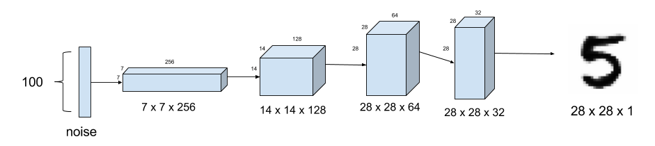
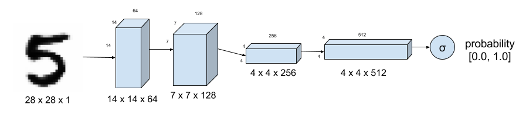
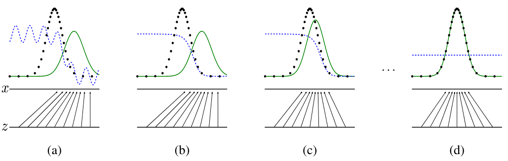

<h1 align='center'> Deep learning - GAN ⚔️ </h1>

**Les réseaux adverbiaux génératifs** (*Generative Adversarial Networks* GAN) permettent de **générer de nouvelles données qui suivent une distribution existante**. 

<br>

## I. **Introduction**

Un GAN est un modèle d’apprentissage non-supervisé composé de deux réseaux neuronaux qui s'entraînent ensemble en compétition:
   - **Le générateur**: Il prend un bruit aléatoire en entrée et génère des données synthétiques. Il a pour but de transformer les vecteurs suivant une distribution de probabilité aléatoire $p_z$ - appelée distribution de probabilité de bruit - en vecteurs suivant la distribution de données naturelles $p_{data}$.   
   *Ex: Avec les données MNIST, le générateur prend en entrée des vecteurs de nombres réels suivant une distribution gaussienne, $p_z$ et doit produire une matrice 28x28 dont les valeurs suivent la distribution de probabilité des données suivies par les images MNIST, $p_{data}$. Le rôle du réseau serait donc de transformer une distribution gaussienne en une distribution de probabilité représentée par les données.*
   
   


   - **Le discriminateur**: Il distingue les données réelles des données générées. L'objectif du discriminateur est de faire la différence entre les échantillons qui suivent la distribution de probabilité des données réelles et les échantillons générés par le générateur. Il prend en entrée soit un échantillon réel, soit un échantillon produit par le générateur, et est entraîné à renvoyer la probabilité que l'image soit réelle. Au maximum, le discriminateur est censé retourner 1 lorsqu'il reçoit une image provenant de l'ensemble de données d'apprentissage et 0 lorsqu'il reçoit une image générée par le générateur.
   
   

L'aspect **adversaire** des réseaux provient des méthodes d'apprentissage. Le générateur est entraîné à "tromper" le discriminateur, c'est-à-dire à faire en sorte qu'il renvoie 1 pour les échantillons générés. Les réseaux jouent un jeu minimax à 2 joueurs. À l'équilibre, le discriminateur devrait toujours renvoyer 0,5: il ne peut plus faire la différence entre les vrais et les faux échantillons, et les faux échantillons suivent donc la même distribution de probabilités que les vrais. Le générateur est entraîné à ce résultat et finit par produire des résultats réalistes.

<br>

Dans ce cadre, deux hypothèses doivent être formulées:
+ Toutes les données de l'ensemble de données d'apprentissage sont supposées suivre la même distribution de probabilité notée $p_{data}$. 

+ La base de données est supposée suffisamment grande pour que la distribution de probabilité obtenue représente bien et uniquement ces données. En d'autres termes, si de nouveaux échantillons peuvent être générés à partir de cette distribution, ils devraient ressembler aux autres éléments de la base de données.


<br>


## II. **Fonctionnement mathématique**

Pour mieux comprendre, appelons G le générateur, D le discriminateur, $z$ une variable suivant la distribution de probabilité du bruit $p_z$ et $x$ une variable suivant la distribution de probabilité des données $p_{data}$. Appelons également $p_g$ la distribution de probabilité suivie par les sorties de G: $G(z)$. 

Le but du générateur est alors de tromper le discriminateur en lui renvoyant des échantillons de type réel, ce qui signifie égaliser $p_g \approx p_{data}$.
Le discriminateur est entraîné à retourner $1$ pour des données réelles: $D(x) = 1$ et $0$ pour les fausses données $D(G(z)) = 0$, tandis que le générateur est entraîné à faire en sorte que le discriminateur renvoie également $1$ pour les fausses données. Par conséquent, D et G jouent le jeu minimax à deux joueurs avec la fonction de valeur $V(G, D)$:

$$\min_{G} \max_{D} V(D,G) = \mathbb{E}_{x\sim p_{data}}[log D(x)] + \mathbb{E}_{z\sim p_{z}}[log(1 - D(G(z)))]$$

Il est possible alors de poser:
- **La fonction de perte du discriminateur**:
  $$L_D = - \mathbb{E}_{x \sim P_{data}} [\log D(x)] - \mathbb{E}_{z \sim P_z} [\log (1 - D(G(z)))]$$
- **La fonction de perte du générateur** (via une descente de gradient opposée):
  $$L_G = - \mathbb{E}_{z \sim P_z} [\log D(G(z))]$$


<h3 align='center'>
    
</h3>


Cette image illustre le processus itératif dans le cadre des GANs, avec l'amélioration progressive du *générateur* et du *discriminateur*:


1. **Diagramme du haut (points noirs et lignes vertes/bleues)**:
   - Les points noirs représentent des données réelles (issues de la distribution réelle $P_{data}$).
   - Les courbes vertes représentent la distribution générée par le générateur $P_{gen}$.
   - Les courbes bleues (pointillées) montrent les décisions du discriminateur à différentes étapes.

2. **Étapes (a) à (d)**:
   - **(a)**: Au début de l'entraînement, le générateur produit des données aléatoires, et sa distribution $P_{gen}$ est très éloignée de $P_{data}$. Le discriminateur est capable de distinguer facilement les données réelles des données générées.
   - **(b)**: Le générateur commence à s'améliorer, et $P_{gen}$ se rapproche légèrement de $P_{data}$. Le discriminateur ajuste ses décisions en conséquence.
   - **(c)**: $P_{gen}$ est encore plus proche de $P_{data}$. Le générateur et le discriminateur s'améliorent mutuellement.
   - **(d)**: Après convergence, $P_{gen} \approx P_{data}$, et le discriminateur est incapable de différencier les deux distributions.

3. **Diagramme du bas (flèches)**:
   - Représente l'interaction entre le générateur (produisant des données) et le discriminateur (apprenant à différencier les données). Cette structure est au cœur des GANs.


<br>


## III. **Étapes d'entraînement**
1. Générer un bruit aléatoire $z$ avec le générateur $G$.
2. Le discriminateur $D$ évalue si les données proviennent de $P_{data}$ ou $P_{gen}$.
3. Le générateur et le discriminateur sont mis à jour tour à tour en minimisant leurs pertes respectives.

L'entraînement de GANs est notoirement délicat. Bien que de nombreuses améliorations concrètes aient été proposées au fil des années, de petits changements dans les hyperparamètres et les choix d'architecture ont également un impact. Une [étude empirique](https://arxiv.org/pdf/1511.06434.pdf) propose des suggestions telles que :

+ Utiliser l'activation `LeakyReLU` dans le discriminateur
+ Abaisser le taux d'apprentissage d'un facteur 10, par exemple à 0,0002
+ Utiliser un terme d'impulsion plus petit $\beta_1$ de 0,5 dans l'optimiseur d'Adam.


<br>

### **Implémentation en Python**

#### a) Avec TensorFlow/Keras:

```python
import tensorflow as tf
from tensorflow.keras.layers import Dense, LeakyReLU, BatchNormalization
from tensorflow.keras.models import Sequential
import numpy as np

# Hyperparamètres
latent_dim = 100
epochs = 10000
batch_size = 64

# Générateur
def build_generator(latent_dim):
    model = Sequential([
        Dense(128, input_dim=latent_dim),
        LeakyReLU(alpha=0.2),
        BatchNormalization(momentum=0.8),
        Dense(256),
        LeakyReLU(alpha=0.2),
        BatchNormalization(momentum=0.8),
        Dense(512),
        LeakyReLU(alpha=0.2),
        BatchNormalization(momentum=0.8),
        Dense(28 * 28, activation='tanh'),  # Pour générer des images 28x28 (normalisées)
    ])
    return model

# Discriminateur
def build_discriminator():
    model = Sequential([
        Dense(512, input_dim=28*28),
        LeakyReLU(alpha=0.2),
        Dense(256),
        LeakyReLU(alpha=0.2),
        Dense(1, activation='sigmoid'),  # Probabilité de réalité
    ])
    return model

# Compilation
generator = build_generator(latent_dim)
discriminator = build_discriminator()
discriminator.compile(optimizer=tf.keras.optimizers.Adam(0.0002, 0.5), loss='binary_crossentropy', metrics=['accuracy'])

# Modèle GAN combiné
discriminator.trainable = False
gan_input = tf.keras.Input(shape=(latent_dim,))
generated_data = generator(gan_input)
gan_output = discriminator(generated_data)
gan = tf.keras.Model(gan_input, gan_output)
gan.compile(optimizer=tf.keras.optimizers.Adam(0.0002, 0.5), loss='binary_crossentropy')

# Entraînement
def train_gan(generator, discriminator, gan, epochs, batch_size, latent_dim):
    (X_train, _), _ = tf.keras.datasets.mnist.load_data()
    X_train = (X_train / 127.5) - 1.0  # Normalisation entre -1 et 1
    X_train = X_train.reshape((-1, 28*28))

    valid = np.ones((batch_size, 1))
    fake = np.zeros((batch_size, 1))

    for epoch in range(epochs):
        # Entraîner le discriminateur
        idx = np.random.randint(0, X_train.shape[0], batch_size)
        real_images = X_train[idx]

        noise = np.random.normal(0, 1, (batch_size, latent_dim))
        generated_images = generator.predict(noise)

        d_loss_real = discriminator.train_on_batch(real_images, valid)
        d_loss_fake = discriminator.train_on_batch(generated_images, fake)
        d_loss = 0.5 * np.add(d_loss_real, d_loss_fake)

        # Entraîner le générateur
        noise = np.random.normal(0, 1, (batch_size, latent_dim))
        g_loss = gan.train_on_batch(noise, valid)

        # Afficher les pertes
        if epoch % 1000 == 0:
            print(f"{epoch} [D loss: {d_loss[0]} | D accuracy: {100*d_loss[1]}%] [G loss: {g_loss}]")

train_gan(generator, discriminator, gan, epochs, batch_size, latent_dim)
```

<br>

---


#### b) Avec PyTorch:

```python
import torch
import torch.nn as nn
import torch.optim as optim
from torchvision import datasets, transforms
from torch.utils.data import DataLoader

# Hyperparamètres
latent_dim = 100
epochs = 10000
batch_size = 64
learning_rate = 0.0002
device = torch.device("cuda" if torch.cuda.is_available() else "cpu")

# Générateur
class Generator(nn.Module):
    def __init__(self, latent_dim):
        super(Generator, self).__init__()
        self.model = nn.Sequential(
            nn.Linear(latent_dim, 128),
            nn.LeakyReLU(0.2),
            nn.BatchNorm1d(128, momentum=0.8),
            nn.Linear(128, 256),
            nn.LeakyReLU(0.2),
            nn.BatchNorm1d(256, momentum=0.8),
            nn.Linear(256, 512),
            nn.LeakyReLU(0.2),
            nn.BatchNorm1d(512, momentum=0.8),
            nn.Linear(512, 28 * 28),
            nn.Tanh()  # Les sorties sont normalisées entre -1 et 1
        )

    def forward(self, z):
        return self.model(z)

# Discriminateur
class Discriminator(nn.Module):
    def __init__(self):
        super(Discriminator, self).__init__()
        self.model = nn.Sequential(
            nn.Linear(28 * 28, 512),
            nn.LeakyReLU(0.2),
            nn.Linear(512, 256),
            nn.LeakyReLU(0.2),
            nn.Linear(256, 1),
            nn.Sigmoid()  # Sortie entre 0 et 1 (probabilité)
        )

    def forward(self, img):
        return self.model(img)

# Initialiser les modèles
generator = Generator(latent_dim).to(device)
discriminator = Discriminator().to(device)

# Optimiseurs
optimizer_G = optim.Adam(generator.parameters(), lr=learning_rate, betas=(0.5, 0.999))
optimizer_D = optim.Adam(discriminator.parameters(), lr=learning_rate, betas=(0.5, 0.999))

# Fonction de perte
adversarial_loss = nn.BCELoss()

# Charger les données MNIST
transform = transforms.Compose([
    transforms.ToTensor(),
    transforms.Normalize([0.5], [0.5])  # Normalisation entre -1 et 1
])

dataloader = DataLoader(
    datasets.MNIST('./data', train=True, download=True, transform=transform),
    batch_size=batch_size,
    shuffle=True
)

# Entraînement
for epoch in range(epochs):
    for i, (imgs, _) in enumerate(dataloader):
        # Préparer les données réelles et générées
        real_imgs = imgs.view(imgs.size(0), -1).to(device)
        valid = torch.ones((imgs.size(0), 1), device=device)  # Labels pour données réelles
        fake = torch.zeros((imgs.size(0), 1), device=device)  # Labels pour données générées

        # ---------------------
        # Entraîner le Discriminateur
        # ---------------------
        z = torch.randn((imgs.size(0), latent_dim), device=device)
        generated_imgs = generator(z)

        real_loss = adversarial_loss(discriminator(real_imgs), valid)
        fake_loss = adversarial_loss(discriminator(generated_imgs.detach()), fake)
        d_loss = (real_loss + fake_loss) / 2

        optimizer_D.zero_grad()
        d_loss.backward()
        optimizer_D.step()

        # ---------------------
        # Entraîner le Générateur
        # ---------------------
        z = torch.randn((imgs.size(0), latent_dim), device=device)
        generated_imgs = generator(z)
        g_loss = adversarial_loss(discriminator(generated_imgs), valid)

        optimizer_G.zero_grad()
        g_loss.backward()
        optimizer_G.step()

    # Afficher les pertes toutes les 1000 itérations
    if epoch % 1000 == 0:
        print(f"[Epoch {epoch}] [D loss: {d_loss.item()}] [G loss: {g_loss.item()}]")
```


<br>


## IV. Equilibre Générateur / Discriminateur 

Il est crucial de maintenir un équilibre entre le générateur et le discriminateur. En effet, si l'un des deux réseaux devient trop performant par rapport à l'autre, cela peut déstabiliser l'entraînement, rendant difficile, voire impossible, la convergence vers une solution optimale. 

- **Cas du discriminateur trop fort**:
   - Si le discriminateur devient rapidement très performant, il peut facilement distinguer les données réelles des données générées.
   - Cela empêche le générateur d'apprendre, car les gradients retournés par le discriminateur ne contiennent plus assez d'information utile (ils sont saturés).

   > Résultat: Le générateur reste bloqué et produit des données de mauvaise qualité.

- **Cas du générateur trop fort**:
   - Si le générateur devient trop performant, il peut "tromper" facilement le discriminateur.
   - Cela conduit à un discriminateur qui ne peut plus fournir de feedback significatif au générateur.

   > Résultat: Le générateur surapprend à produire un sous-ensemble spécifique des données (appelé *mode collapse*), perdant la diversité des exemples générés.

<br>

### **Solutions pour maintenir l'équilibre**

1. **Concevoir des architectures adaptées**:
   - Les architectures du générateur et du discriminateur doivent être bien dimensionnées (en termes de capacité et de nombre de couches). Par exemple:
     - Le discriminateur ne doit pas être trop "profond" ou complexe par rapport au générateur.
     - Le générateur doit avoir suffisamment de capacité pour rivaliser.

2. **Appliquer des techniques de régularisation**:
   - **Régularisation de gradient pour le discriminateur**:
     Ajouter une pénalité sur les gradients du discriminateur, comme dans **WGAN-GP** (Wasserstein GAN avec Gradient Penalty), pour éviter que le discriminateur ne devienne trop fort.
     $$\lambda \cdot (\|\nabla D(x)\|_2 - 1)^2$$

   - **Dropout ou autres techniques** dans le discriminateur pour ralentir son apprentissage.

3. **Optimisation différenciée**:
   - Choisir des **ratios d'entraînement** différents:
     - Par exemple, entraîner le discriminateur sur plusieurs itérations pour chaque itération d'entraînement du générateur (ou inversement).
   - Ajuster les **taux d'apprentissage** indépendamment:
     - Un taux d'apprentissage plus faible pour le discriminateur peut être utile s'il converge trop vite.

4. **Utiliser des fonctions de perte améliorées**:
   - La fonction de perte classique basée sur la probabilité logistique peut entraîner une saturation.
   - Les versions comme la **perte Wasserstein** (introduite dans les WGANs) offrent un feedback plus stable.

5. **Données équilibrées pour l'entraînement**:
   - Veiller à ce que les données d'entraînement soient bien équilibrées et représentatives pour éviter que le discriminateur ne se spécialise trop sur des cas particuliers.

6. **Évaluation continue des performances**:
   - Il est important de surveiller les pertes $L_D$ et $L_G$ pendant l'entraînement.
     - Si $L_D$ tend vers zéro trop rapidement, cela indique que le discriminateur est trop fort.
     - Si $L_G$ diminue très lentement, cela peut signaler que le générateur est en difficulté.

---

### **Illustrations dans le code**

Voici une modification du code précédent pour maintenir un équilibre:

```python
# Ajouter des itérations multiples pour le discriminateur
for epoch in range(epochs):
    for _ in range(2):  # Former le discriminateur deux fois plus que le générateur
        idx = np.random.randint(0, X_train.shape[0], batch_size)
        real_images = X_train[idx]

        noise = np.random.normal(0, 1, (batch_size, latent_dim))
        generated_images = generator.predict(noise)

        d_loss_real = discriminator.train_on_batch(real_images, valid)
        d_loss_fake = discriminator.train_on_batch(generated_images, fake)
        d_loss = 0.5 * np.add(d_loss_real, d_loss_fake)

    # Former le générateur moins souvent
    noise = np.random.normal(0, 1, (batch_size, latent_dim))
    g_loss = gan.train_on_batch(noise, valid)

    if epoch % 1000 == 0:
        print(f"{epoch} [D loss: {d_loss[0]} | D acc: {100*d_loss[1]}%] [G loss: {g_loss}]")
```

---
<br>

Pour évaluer si l'équilibre est maintenu, tracer les pertes du générateur et du discriminateur:

```python
import matplotlib.pyplot as plt

d_losses = []
g_losses = []

for epoch in range(epochs):
    # Entraînement du discriminateur...
    d_losses.append(d_loss[0])

    # Entraînement du générateur...
    g_losses.append(g_loss)

# Visualiser les pertes
plt.plot(d_losses, label="Discriminator Loss")
plt.plot(g_losses, label="Generator Loss")
plt.legend()
plt.show()
```