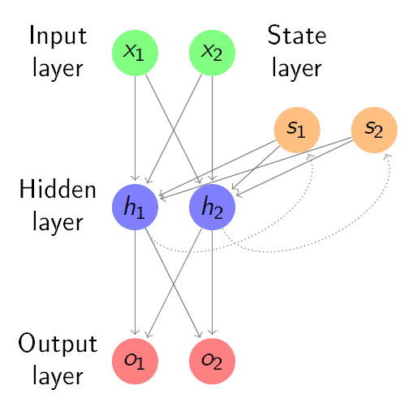
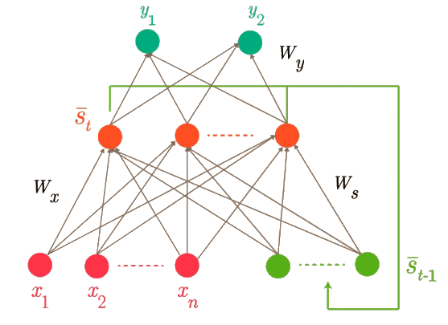
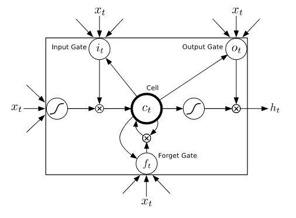

<h1 align='center'> Deep learning - Recurrent Neural Networks 🔁</h1>

Ce document traite d'un nouveau type de couche de réseau neuronal profond: **les couches récurrentes**. Ces types de couches ont pour caractéristique commune d'avoir un état interne ou **caché**. Cela les rend bien adaptés aux données séquentielles, telles que **les séries temporelles** ou **les données textuelles**. Ils sont très utilisés dans le traitement du langage naturel.

## I. Introduction: *Finding Structure in Time* (Elman, 1990)

Dans son travail fondamental sur les Réseaux de Neurones Récurrents, Elman a examiné une variété de problèmes qui ne pouvaient pas être résolus avec des "réseaux de neurones standard". Le trait commun de ces problèmes, présentés dans son article intitulé *Finding Structure in Time* (publié en 1990), est que les données sous-jacentes ont une structure temporelle (par exemple, elles présentent une certaine périodicité ou sont organisées sous forme de séquence).

Ici, une adaptation de l'un de ces problèmes sera reproduit en étudiant **l'apprentissage des frontières de mots**.

### 1. Problème: *Le Héron* (La Fontaine, 1678)

Dans son article, Elman travaillait avec un lexique composé de 15 mots en anglais. Dans cet exercice, des mots français seront utilisés à la place, ainsi que les 16 premiers mots rencontrés dans *Le Héron* (La Fontaine, 1678).

<div align="center"><b>Un jour sur ses longs pieds, allait, je ne sais où,<br/>
Le Héron au long bec </b> emmanché d'un long cou.<br/>
Il côtoyait une rivière.</div>

À partir de ces 16 mots, de nombreuses phrases seront générées en échantillonnant aléatoirement dans le lexique.


### 2. Préparation des données et définition de la tâche

Pour travailler avec PyTorch, il faut organiser les données en tenseurs. Chaque caractère dans le texte est l'une des 26 lettres de l'alphabet. Par conséquent, *5 bits* suffisent pour encoder chaque caractère.

La tâche que propose Elman pour ce problème est **de prédire le prochain caractère de la séquence**. Bien performer à cette tâche signifierait que le réseau a réussi à comprendre que les séquences de caractères forment des mots et sont donc prévisibles. Pour implémenter la tâche dans PyTorch, il faut créer 2 tenseurs: 
- l'un définissant l'*entrée* (**input**) qui sera donné au réseau (c'est-à-dire le caractère actuel)
- l'autre étant la *cible* (**target**) (c'est-à-dire le caractère suivant).

```python
# Convert a character into a 5 bits encoding
def encodeCharacter(char):
    index = string.ascii_lowercase.index(char) #Index in the alphabet 
    output = [float(x) for x in '{:05b}'.format(index)] #convert to 5 bits
    return output 

# Encode sequence
input = []
target = []

for i in range(len(text)-1):
    input.append(encodeCharacter(text[i]))
    target.append(encodeCharacter(text[i + 1]))

# Convert to tensors
input = torch.from_numpy(np.array(input))
target = torch.from_numpy(np.array(target))

print("tensors size:", input.size())
print("first input: ", input[0])
print("first target: ", target[0])
```

### 3. Méthode simple: ANN avec une seule couche cachée

En tant que première approche et de référence, il est nécessaire de voir comment un réseau avec une seule couche cachée pourrait se comporter.   
Pour entraîner le réseau, les mêmes paramètres que ceux proposés par Elman dans son article seront utilisés: 
- Les couches d'entrée et de sortie de taille 5 (correspondant à la taille de codage des lettres)
- Une couche cachée de taille 20
- Un entraînement consistant en 10 itérations complètes sur la séquence.

```python
class LinearNN(nn.Module):
    def __init__(self, input_size, hidden_size, output_size):
        super(LinearNN, self).__init__()
        self.hidden_size = hidden_size
        self.linear1 = nn.Linear(input_size, hidden_size)
        self.linear2 = nn.Linear(hidden_size, output_size)
        self.sig=nn.Sigmoid()

    def forward(self, input):
        hidden = self.linear1(input)
        output = self.sig(self.linear2(hidden))
        return output


n_hidden = 20
#network initialization
linearnn = LinearNN(5, n_hidden, 5).double()

#criterion and optimizer for training
criterion = nn.MSELoss()
optimizer = torch.optim.SGD(linearnn.parameters(), lr=0.1, momentum=0.9)

#training iterations
for iter in range(10):
    running_loss=0
    for char in range(input.size(0)):
        optimizer.zero_grad()
        output = linearnn(input[char].reshape(1,5))
        loss = criterion(output, target[char].reshape(1,5))
        loss.backward(retain_graph=True)
        running_loss+=loss.item()
        optimizer.step()
    print("iter ",str(iter)," average loss on iteration:", str(running_loss/input.size(0)))
```

En considérant la perte, le réseau ne semble pas avoir appris grand-chose. Cependant, il est clair que le réseau n'est pas très performant lorsqu'il s'agit d'apprendre à prédire la lettre suivante à partir de la lettre actuelle. L'interprétation d'Elman de ce résultat est qu'il manque un aspect fondamental dans l'implémentation: **la récurrence**.

En effet, lors de la prédiction de la lettre suivante à partir de la lettre actuelle, il peut être utile de garder en mémoire ce que le réseau a prédit auparavant. Cette mémoire permet au réseau de tenir compte non seulement de son état actuel lorsqu'il prédit le résultat, mais aussi de l'état précédent.
> Pour les données organisées en séquences logiquement structurées (par exemple les mots), le concept de récurrence est crucial pour obtenir de bons résultats.

### 4. Introduction à la récurrence

La proposition d'Elman est d'ajouter une **couche récurrente**. À chaque étape, la couche cachée reçoit non seulement l'entrée de la couche d'entrée, mais aussi de la couche récurrente. L'état de la couche cachée est ensuite copié dans la couche récurrente pour l'étape suivante. 

Cela permet au réseau de conserver une certaine mémoire de l'état précédent.

<h3 align='center'>
    
</h3>


En pyTorch, cela peut se faire en utilisant la couche **RNNCell**.


```python
class RNN(nn.Module):
    def __init__(self, input_size, hidden_size, output_size):
        super(RNN, self).__init__()
        self.hidden_size = hidden_size
        self.rnn1 = nn.RNNCell(input_size, hidden_size)
        self.linear = nn.Linear(hidden_size, output_size)
        self.sig = nn.Sigmoid()

    def forward(self, input, hidden):
        hidden = self.rnn1(input, hidden)
        output = self.sig(self.linear(hidden))
        return output, hidden #we return both output and hidden state, as both will be needed for the next step
    
    def init_hidden(self):
        return torch.zeros(1, self.hidden_size, dtype=torch.double)


n_hidden = 20
#network initialization
rnn = RNN(5, n_hidden, 5).double()

#criterion and optimizer for training
criterion = nn.MSELoss()
optimizer = torch.optim.SGD(rnn.parameters(), lr=0.1, momentum=0.9)

#training iterations
for iter in range(10):
    running_loss=0
    hidden = rnn.init_hidden() #initialize hidden state
    for i in range(input.size(0)):
        optimizer.zero_grad()
        output, hidden = rnn(input[i].reshape(1,5),hidden.detach())
        loss = criterion(output, target[i].reshape(1,5))
        loss.backward(retain_graph=True)
        running_loss += loss.item()
        optimizer.step()
    print("iter ",str(iter)," average loss on iteration:", str(running_loss/input.size(0)))
```

Une certaine convergence peut être constatée, même si elle n'est pas très convaincante (car la tâche reste difficile).

En analysant l'erreur faite sur chaque lettre, un schéma apparaît très clairement: l'erreur est élevée au début des mots, puis diminue au fur et à mesure que le mot devient plus clair. 

Cela correspond tout à fait à la manière dont un humain résoudrait ce problème: *prédire la lettre suivante à partir de la lettre actuelle est impossible, à moins qu'il n'y ait une structure (imposée par les mots) dans cette séquence*.
Par exemple, avec uniquement la lettre « h », il n'y a aucun moyen de prédire efficacement la lettre suivante. Cependant, en continuant à lire et en gardant en mémoire que les premières lettres sont "*hero*", il est beaucoup plus probable que la prédiction de la lettre suivante retourne  "n" (pour former le mot "*heron*").


<br>
<br>

## II. Prévision des séries temporelles

### 1. Pre-processing
La première étape de traitement des données est de **normaliser les données**. Cela est bénéfique pour l'entraînement des réseaux de neurones récurrents, mais nécessite une connaissance du domaine. (*Ex*: connaissance des limites physiques des capteurs)  

Une autre préparation souvent effectuée avec des données temporelles est de vérifier si elles sont **stationnaires**, c'est-à-dire si la moyenne et la variance changent au fil du temps. Pour ce faire, il est possible d'utiliser le [test de Dickey-Fuller](https://en.wikipedia.org/wiki/Dickey%E2%80%93Fuller_test). Ce test peut être très coûteux à calculer, alors il faut sous-échantillonner les données. Une petite valeur signifie que la série temporelle **est stationnaire**. Ce n'est pas une condition nécessaire pour les LSTM, mais cela facilitera l'entraînement. Lorsque la série temporelle n'est pas stationnaire (`p_value > 0.05`), il est normal de prédire **la différence** entre les pas de temps, c'est-à-dire $$y_t - y_{t-1},$$ qui peut être calculée en utilisant `diff` dans `NumPy` et `shift` dans `pandas`.

### 2. Prédiction univariée et 1-étape

Dans un permier temps, les prédictions seront:
+ Univariées: Un signal pour prédire l'avenir de ce signal sans tenir compte des autres caractéristiques. L'inverse est multivarié, où plusieurs caractéristiques sont utilisées dans la prédiction (et plusieurs caractéristiques peuvent être prédites simultanément).
+ 1 étape: Une étape dans le futur sera prédite, ce qui peut également être considéré comme ayant un horizon d'un échantillon.


Pour un horizon de $1$, la ligne de base naïve fonctionne bien et si l'horizon dépasse les $1 \text{ms}$, les performances se dégradent.   
Une autre approche consiste alors à diminuer de façon exponentielle la dépendance à l'égard des prédictions passées: le *lissage exponentiel*. Le taux de diminution des prédictions passées est le paramètre $\alpha$.   
Bien que les valeurs alpha inférieures aident à prédire la tendance générale de nos données, leur RMSE est pire que l'utilisation d'un historique très court. Ainsi, pour des données EEG, le modèle a encore du mal à faire bon usage des données historiques pour prédire les données futures. 


Alors, au lieu d'un paramètre unique pour la décomposition de l'historique, il faudra désormais un réseau neuronal récurrent pour informer la dépendance à la mémoire pour la prédiction, et les paramètres du réseau seront optimisés à l'aide de la descente de gradient stochastique.

<br>
<br>

### 3. RNN
Une couche de réseau de neurones récurrents (RNN) est très similaire à une couche de réseau de neurones entièrement connectée (*feed-forward*): elle possède une matrice de poids $W_x$ reliant la couche précédente $x$ à chaque neurone de la couche récurrente, un terme de biais pour chaque neurone, et une fonction d'activation.   
Cependant, un RNN possède également un **état**: spécifiquement, chaque neurone est connecté à tous les autres neurones de la même couche avec un délai de temps de $1 \text{ms}$. Cela signifie qu'une couche de RNN dispose d'une seconde matrice de poids $W_s$ de taille $n \times n$, où $n$ est le nombre de neurones dans la couche récurrente. 

L'état peut être calculé comme suit:
$$s_t = \tanh(W_{x} x + b_{x} + W_{s} s_{t-1} + b_{s})$$

Une manière d'interpréter ces connexions récurrentes est de considérer les activations précédentes de la couche récurrente comme un **état caché**, et d'utiliser cet état caché comme entrée pour le réseau:

<h3 align='center'>
    
</h3>

La principale différence avec les réseaux de neurones récurrents (RNN) est qu'ils dépendent de l'état précédent pour calculer l'état actuel. Au lieu de simplement prédire $Y = f(x)$ comme dans les réseaux de neurones feed-forward, les réseaux récurrents effectuent une prédiction du type $Y_1 = f(x_1, f(x_0))$.


```python
class RNN(nn.Module):
    def __init__(self, input_size, hidden_size, output_size):
        super(RNN, self).__init__()
        self.hidden_size = hidden_size
        self.rnn1 = nn.RNNCell(input_size, hidden_size)
        self.linear = nn.Linear(hidden_size, output_size)

    def forward(self, inp, hidden, future=0):
        outputs = []
        for signal in inp.split(1, dim=1):  # Process input sequence
            hidden = self.rnn1(signal, hidden)
            output = self.linear(hidden)
            outputs.append(output)
        for _ in range(future):  # Predict future timesteps
            hidden = self.rnn1(output, hidden)
            output = self.linear(hidden)
            outputs.append(output)
        outputs = torch.cat(outputs, dim=1)
        return outputs, hidden

    def init_hidden(self, batch_size):
        return torch.zeros(batch_size, self.hidden_size, dtype=torch.float32)


# Entraînement
criterion = nn.MSELoss()
optimizer = optim.Adam(rnn.parameters(), lr=0.01)

for epoch in range(100):  # Nombre d'époques
    hidden = rnn.init_hidden(train_input.size(0))  # Batch size dynamique
    optimizer.zero_grad()
    out, hidden = rnn(train_input[:,:-horizon], hidden, future=horizon)
    loss = criterion(out[:,:-horizon], train_input[:, horizon:])
    print(f"Epoch {epoch + 1}, Loss: {loss.item():.4f}")
    loss.backward()
    optimizer.step()

# Évaluation
hidden = rnn.init_hidden(test_input.size(0))
with torch.no_grad():
    output, hidden = rnn(test_input, hidden, future=horizon)
    y = output.numpy()

target = test_input[0, horizon:]
print("MSE of the RNN prediction after training:",
      np.sqrt(mean_squared_error(target, y[0,:len(target)])))

# Visualisation
plt.figure(figsize=(12, 6))
plt.plot(target, label='Real')
plt.plot(y[0,:len(target)], label='Prediction')
plt.xlabel('Timestep')
plt.ylabel('Value')
plt.legend()
plt.show()
```


<br>
<br>

### 4. *Long Short-Term Memory* (LSTM)
Les **LSTM** sont un type de réseau de neurones récurrents (RNN) particulièrement adapté pour le traitement de données séquentielles ou temporelles. Contrairement aux RNN classiques, ils sont capables de conserver des informations importantes sur de longues périodes grâce à leur structure unique. En effet, les RNN classiques souffrent du problème de **disparition ou d'explosion des gradients**, ce qui rend difficile l'apprentissage des relations à long terme.   
Les LSTM surmontent ce problème grâce à un mécanisme de mémoire contrôlée par des "portes". Voici alors quelques applications courantes des LSTM:   
- Analyse de séries temporelles (ex. prévisions financières, météorologie).
- Traitement du langage naturel (NLP): traduction automatique, génération de texte, analyse de sentiment.
- Reconnaissance vocale et traitement audio.
- Génération de musique ou d’images basées sur des séquences.

#### **a) Structure des LSTM**
<h3 align='center'>
    
</h3>


Chaque cellule LSTM possède trois portes principales:
- **Porte d’entrée (Input Gate)**: décide quelles informations des données d'entrée doivent être ajoutées à l'état de mémoire.
- **Porte d'oubli (Forget Gate)**: détermine quelles informations doivent être oubliées dans l'état précédent.
- **Porte de sortie (Output Gate)**: contrôle quelles informations sont envoyées comme sortie à l'étape suivante.

#### Équations des LSTM:
1. **Porte d’oubli**:  
   $$f_t = \sigma(W_f \cdot [h_{t-1}, x_t] + b_f)$$
2. **Porte d’entrée**:  
   $$i_t = \sigma(W_i \cdot [h_{t-1}, x_t] + b_i)$$  
   $$\tilde{C}_t = \tanh(W_c \cdot [h_{t-1}, x_t] + b_c)$$
3. **Mise à jour de l’état de la cellule**:  
   $$C_t = f_t \cdot C_{t-1} + i_t \cdot \tilde{C}_t$$
4. **Porte de sortie**:  
   $$o_t = \sigma(W_o \cdot [h_{t-1}, x_t] + b_o)$$  
   $$h_t = o_t \cdot \tanh(C_t)$$  

---

#### **b) Implémentation avec Keras**

Keras propose une implémentation facile des LSTM à travers le module `tensorflow.keras.layers.LSTM`.

#### Exemple 1: Prédiction avec des séries temporelles
Prédire une série temporelle comme les prix d'une action en utilisant des LSTM.

```python
import numpy as np
import tensorflow as tf
from tensorflow.keras.models import Sequential
from tensorflow.keras.layers import LSTM, Dense

# Générer des données fictives (série temporelle)
data = np.sin(np.linspace(0, 100, 1000))  # Données sinusoïdales
sequence_length = 50

# Préparer les données en séquences
X = []
y = []
for i in range(len(data) - sequence_length):
    X.append(data[i:i+sequence_length])
    y.append(data[i+sequence_length])
X = np.array(X)
y = np.array(y)

# Reshape pour que chaque séquence ait une dimension supplémentaire
X = X.reshape((X.shape[0], X.shape[1], 1))

# Création du modèle LSTM
model = Sequential([
    LSTM(50, activation='relu', input_shape=(sequence_length, 1)),
    Dense(1)
])

# Compilation du modèle
model.compile(optimizer='adam', loss='mse')

# Entraînement
model.fit(X, y, epochs=20, batch_size=32, verbose=1)
```

<br>

#### Paramètres et Hyperparamètres Importants

Lors de l'utilisation des LSTM, certains paramètres influencent directement la performance:

1. **Units**: Nombre de neurones dans chaque couche LSTM. Plus il y en a, plus la capacité du modèle est grande.
2. **Activation**: La fonction d'activation par défaut est `'tanh'`, mais vous pouvez tester d'autres fonctions.
3. **Recurrent Activation**: La fonction utilisée dans les portes récurrentes (souvent `'sigmoid'`).
4. **Return Sequences**:
   - Si `True`, la couche retourne toute la séquence de sorties.
   - Si `False`, elle ne retourne que la dernière sortie (par défaut).
5. **Dropout**: Pour réduire le surapprentissage, une fraction des connexions peut être désactivée aléatoirement.
6. **Recurrent Dropout**: Applique un dropout spécifique aux connexions récurrentes.

<br>


#### c) **Implémentation avec PyTorch**

PyTorch fournit une classe appelée `torch.nn.LSTM` pour implémenter les LSTM. Contrairement à Keras, qui abstrait beaucoup de détails, PyTorch offre plus de contrôle, ce qui est souvent utile pour des tâches avancées.   
Un LSTM PyTorch typique comprend:
1. Une ou plusieurs couches LSTM (`torch.nn.LSTM`).
2. Un module Fully Connected (`torch.nn.Linear`) pour transformer les sorties LSTM en prédictions finales.
3. Une boucle d'entraînement explicite où les données sont passées dans le modèle.


#### Exemple 2: Prédiction avec des séries temporelles

```python
import numpy as np
import torch
from torch.utils.data import DataLoader, Dataset

# Génération de données sinusoïdales
data = np.sin(np.linspace(0, 100, 1000))  # Données sinusoïdales
sequence_length = 50

# Préparation des données pour LSTM
X = []
y = []
for i in range(len(data) - sequence_length):
    X.append(data[i:i+sequence_length])
    y.append(data[i+sequence_length])

X = np.array(X)
y = np.array(y)

# Conversion en tenseurs PyTorch
X_tensor = torch.tensor(X, dtype=torch.float32)
y_tensor = torch.tensor(y, dtype=torch.float32)

# Création d'un DataLoader pour faciliter l'entraînement
class TimeSeriesDataset(Dataset):
    def __init__(self, X, y):
        self.X = X
        self.y = y
    
    def __len__(self):
        return len(self.X)
    
    def __getitem__(self, idx):
        return self.X[idx], self.y[idx]

dataset = TimeSeriesDataset(X_tensor, y_tensor)
dataloader = DataLoader(dataset, batch_size=32, shuffle=True)


import torch.nn as nn

class LSTMModel(nn.Module):
    def __init__(self, input_size, hidden_size, output_size, num_layers=1):
        super(LSTMModel, self).__init__()
        self.hidden_size = hidden_size
        self.num_layers = num_layers
        
        # Définition de la couche LSTM
        self.lstm = nn.LSTM(input_size, hidden_size, num_layers, batch_first=True)
        
        # Couche fully connected
        self.fc = nn.Linear(hidden_size, output_size)
    
    def forward(self, x):
        # Initialisation des états cachés
        h0 = torch.zeros(self.num_layers, x.size(0), self.hidden_size).to(x.device)
        c0 = torch.zeros(self.num_layers, x.size(0), self.hidden_size).to(x.device)
        
        # Passage à travers la couche LSTM
        out, _ = self.lstm(x, (h0, c0))
        
        # On prend la dernière sortie (séquence finale)
        out = self.fc(out[:, -1,:])
        return out
```

<br>

#### Paramètres importants:
- **`input_size`**: Nombre de caractéristiques dans chaque séquence d'entrée.
- **`hidden_size`**: Nombre de neurones dans la couche LSTM.
- **`num_layers`**: Nombre de couches LSTM empilées.
- **`batch_first=True`**: Si `True`, les dimensions de l'entrée seront `(batch_size, sequence_length, input_size)`.

---

#### Entraînement du modèle

```python
# Instancier le modèle
input_size = 1  # Une seule caractéristique par point temporel
hidden_size = 50
output_size = 1
num_layers = 1

model = LSTMModel(input_size, hidden_size, output_size, num_layers)

# Définir la fonction de perte et l'optimiseur
criterion = nn.MSELoss()
optimizer = torch.optim.Adam(model.parameters(), lr=0.001)

# Boucle d'entraînement
num_epochs = 20
for epoch in range(num_epochs):
    for X_batch, y_batch in dataloader:
        # Mettre les données sur le bon format
        X_batch = X_batch.unsqueeze(-1)  # Ajouter une dimension pour input_size
        y_batch = y_batch.unsqueeze(-1)  # Ajouter une dimension pour la sortie
        
        # Forward pass
        outputs = model(X_batch)
        loss = criterion(outputs, y_batch)
        
        # Backward pass et optimisation
        optimizer.zero_grad()
        loss.backward()
        optimizer.step()
    
    print(f"Epoch {epoch+1}/{num_epochs}, Loss: {loss.item():.4f}")
```

<br>


#### **d) Traitement de Texte avec LSTM**

#### **Exemple 3: Classification de sentiment avec des LSTM**
Voici un exemple où l’on utilise des LSTM pour classer des avis en "positifs" ou "négatifs".

```python
from tensorflow.keras.datasets import imdb
from tensorflow.keras.preprocessing.sequence import pad_sequences
from tensorflow.keras.models import Sequential
from tensorflow.keras.layers import Embedding, LSTM, Dense

# Charger les données IMDB
max_features = 10000  # Taille du vocabulaire
max_len = 200  # Longueur maximale des séquences

(X_train, y_train), (X_test, y_test) = imdb.load_data(num_words=max_features)

# Prétraitement: Rendre toutes les séquences de même longueur
X_train = pad_sequences(X_train, maxlen=max_len)
X_test = pad_sequences(X_test, maxlen=max_len)

# Création du modèle
model = Sequential([
    Embedding(input_dim=max_features, output_dim=128, input_length=max_len),
    LSTM(64, dropout=0.2, recurrent_dropout=0.2),
    Dense(1, activation='sigmoid')
])

# Compilation
model.compile(optimizer='adam',
              loss='binary_crossentropy',
              metrics=['accuracy'])

# Entraînement
model.fit(X_train, y_train, epochs=5, batch_size=64, validation_split=0.2)

# Évaluation
loss, accuracy = model.evaluate(X_test, y_test)
print(f"Test Accuracy: {accuracy}")
```

---

#### **e) Utilisation Avancée des LSTM**
#### **Bidirectional LSTM**
Pour capturer les relations dans les deux directions (passé et futur), utilisez les **LSTM bidirectionnels**:

```python
from tensorflow.keras.layers import Bidirectional

model = Sequential([
    Embedding(input_dim=max_features, output_dim=128, input_length=max_len),
    Bidirectional(LSTM(64, dropout=0.2, recurrent_dropout=0.2)),
    Dense(1, activation='sigmoid')
])
```

#### **Empilement de couches LSTM**
Ajoutez plusieurs couches LSTM pour accroître la complexité du modèle:

```python
model = Sequential([
    LSTM(128, return_sequences=True, input_shape=(sequence_length, 1)),
    LSTM(64, return_sequences=False),
    Dense(1)
])
```


<br>
<br>

### 5. Gated Recurrent Units (GRU)

Les **GRU** sont une variante simplifiée des réseaux de neurones récurrents (RNN), introduite pour résoudre les limitations des RNN classiques, tout en étant plus légère que les LSTM.   
- Comme les LSTM, les GRU sont conçues pour **apprendre des dépendances à long terme** dans des données séquentielles.
- Contrairement aux LSTM, elles sont plus simples, avec moins de paramètres, ce qui les rend plus rapides à entraîner tout en maintenant une performance compétitive. les GRU trouvent des applications en:
- Analyse de séries temporelles: prévisions de données financières, météorologie.
- Traitement du langage naturel (NLP): traduction, génération de texte, classification.
- Traitement d'audio ou vidéo séquentiel.

---

#### **a) Structure des GRU**
Les GRU utilisent deux portes principales:
1. **Porte de mise à jour (Update Gate)**: contrôle la quantité d'information provenant du passé qui doit être conservée.
2. **Porte de réinitialisation (Reset Gate)**: décide combien d'information de l'état précédent doit être oubliée.

#### Équations des GRU:
1. **Porte de mise à jour**:  
   $$z_t = \sigma(W_z \cdot [h_{t-1}, x_t] + b_z)$$
   où $z_t$ est le vecteur de mise à jour.

2. **Porte de réinitialisation**:  
   $$r_t = \sigma(W_r \cdot [h_{t-1}, x_t] + b_r)$$
   où $r_t$ est le vecteur de réinitialisation.

3. **État candidat**:  
   $$\tilde{h}_t = \tanh(W_h \cdot [r_t \odot h_{t-1}, x_t] + b_h)$$

4. **État final**:  
   $$h_t = (1 - z_t) \odot h_{t-1} + z_t \odot \tilde{h}_t$$

---


#### **b) Implémentation GRU avec Keras**

Keras propose une couche **`GRU`** similaire à `LSTM`.

#### Exemple: Prédiction de séries temporelles
```python
import numpy as np
import tensorflow as tf
from tensorflow.keras.models import Sequential
from tensorflow.keras.layers import GRU, Dense

# Générer des données sinusoïdales
data = np.sin(np.linspace(0, 100, 1000))  # Données sinusoïdales
sequence_length = 50

# Préparer les données
X = []
y = []
for i in range(len(data) - sequence_length):
    X.append(data[i:i+sequence_length])
    y.append(data[i+sequence_length])
X = np.array(X)
y = np.array(y)

# Reshape pour GRU
X = X.reshape((X.shape[0], X.shape[1], 1))

# Modèle avec GRU
model = Sequential([
    GRU(50, activation='relu', input_shape=(sequence_length, 1)),
    Dense(1)
])

# Compilation du modèle
model.compile(optimizer='adam', loss='mse')

# Entraînement
model.fit(X, y, epochs=20, batch_size=32, verbose=1)
```

<br>

#### **c) Implémentation GRU avec PyTorch**

PyTorch fournit également une implémentation native des GRU via la classe `torch.nn.GRU`.

#### Exemple: Prédiction de séries temporelles
```python
import numpy as np
import torch
import torch.nn as nn
from torch.utils.data import DataLoader, Dataset

# Générer des données
data = np.sin(np.linspace(0, 100, 1000))
sequence_length = 50

# Préparer les données
X = []
y = []
for i in range(len(data) - sequence_length):
    X.append(data[i:i+sequence_length])
    y.append(data[i+sequence_length])

X = np.array(X, dtype=np.float32)
y = np.array(y, dtype=np.float32)

# Convertir en tenseurs PyTorch
X_tensor = torch.tensor(X).unsqueeze(-1)  # Ajouter une dimension pour l'input_size
y_tensor = torch.tensor(y).unsqueeze(-1)

# Dataset et DataLoader
class TimeSeriesDataset(Dataset):
    def __init__(self, X, y):
        self.X = X
        self.y = y

    def __len__(self):
        return len(self.X)

    def __getitem__(self, idx):
        return self.X[idx], self.y[idx]

dataset = TimeSeriesDataset(X_tensor, y_tensor)
dataloader = DataLoader(dataset, batch_size=32, shuffle=True)

# Modèle GRU avec PyTorch
class GRUModel(nn.Module):
    def __init__(self, input_size, hidden_size, output_size, num_layers=1):
        super(GRUModel, self).__init__()
        self.gru = nn.GRU(input_size, hidden_size, num_layers, batch_first=True)
        self.fc = nn.Linear(hidden_size, output_size)
    
    def forward(self, x):
        h0 = torch.zeros(1, x.size(0), hidden_size).to(x.device)  # État initial caché
        out, _ = self.gru(x, h0)
        out = self.fc(out[:, -1,:])  # Prendre la dernière sortie
        return out

# Hyperparamètres
input_size = 1
hidden_size = 50
output_size = 1

model = GRUModel(input_size, hidden_size, output_size)
criterion = nn.MSELoss()
optimizer = torch.optim.Adam(model.parameters(), lr=0.001)

# Entraînement
num_epochs = 20
for epoch in range(num_epochs):
    for X_batch, y_batch in dataloader:
        outputs = model(X_batch)
        loss = criterion(outputs, y_batch)
        optimizer.zero_grad()
        loss.backward()
        optimizer.step()
    print(f"Epoch {epoch+1}/{num_epochs}, Loss: {loss.item():.4f}")
```

<br>

#### **d) Différences GRU vs LSTM**
| **Aspect**             | **GRU**                          | **LSTM**                       |
|-------------------------|-----------------------------------|---------------------------------|
| **Complexité**          | Moins complexe (2 portes)         | Plus complexe (3 portes)       |
| **Performance**         | Plus rapide, moins coûteux       | Peut être plus précis          |
| **Capacité de mémoire** | Suffisante pour de nombreuses tâches | Meilleure pour de longues séquences |
| **Paramètres**          | Moins de paramètres à entraîner  | Plus de paramètres             |


<br>

- Les **GRU** sont une alternative plus rapide et légère aux **LSTM**, tout en conservant la capacité de modéliser des dépendances longues dans les séquences.
- Elles sont particulièrement utiles lorsque:
  - Les ressources matérielles sont limitées.
  - Les dépendances à long terme ne sont pas critiques.
- L'implémentation est simple avec **Keras** ou **PyTorch**, et le choix entre les deux dépend du niveau de contrôle souhaité.

Les **GRU** sont un excellent compromis entre performance et complexité, ce qui en fait un choix populaire dans de nombreuses applications pratiques.