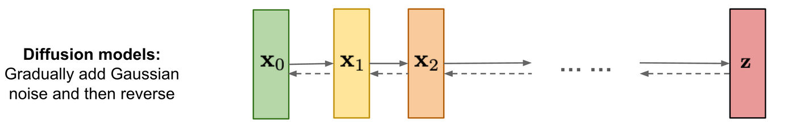

<h1 align='center'> Deep learning - Score-Based Generative Modeling 🎯</h1>

Les modèles basés sur le score, également appelés modèles de diffusion, sont une famille d'approches basées sur [l'estimation des gradients de la distribution des données](https://arxiv.org/abs/1907.05600). Ces méthodes génèrent des échantillons en échantillonnant à partir d'une distribution aléatoire, puis en suivant une estimation du gradient de la distribution des données pour construire des échantillons à partir de la distribution apprise. 




## I. Introduction

### 1. **Idées clés**
- **Score de densité**: 
   - Le score d'une distribution $p(x)$ est défini comme le gradient du logarithme de la densité:
     $$\nabla_x \log p(x)$$
   - Il s'agit d'une direction qui indique où la probabilité $p(x)$ augmente le plus rapidement dans l'espace des données.

- **Objectif**:
   - L'objectif du SBGM est de modéliser le **score** (et non directement la densité) pour des distributions complexes. Une fois le score appris, on peut générer des échantillons en suivant une dynamique stochastique appropriée.

- **Diffusion et Bruit**:
   - Pour simplifier l'apprentissage des scores, les données sont progressivement bruitées jusqu'à une distribution simple (comme une gaussienne). Ce processus est appelé **processus de diffusion avant**.
   - Le **processus inverse** consiste à enlever le bruit de manière progressive, en suivant les gradients appris, pour revenir aux données d'origine.

<br>

### 2. **Composants fondamentaux**
- **Processus de Bruitage**:
   - On ajoute du bruit aux données pour obtenir une séquence de distributions $p_t(x)$, où $t$ indique un niveau de bruit.
   - Par exemple, dans un processus gaussien, les données sont progressivement transformées en bruit pur $\mathcal{N}(0, I)$:
     $$p_t(x) = \mathcal{N}(x; \sqrt{\alpha_t}x_0, (1 - \alpha_t)I)$$

- **Apprentissage du Score**:
   - Le réseau neuronal $s_\theta(x, t)$ est entraîné pour approximer le score $\nabla_x \log p_t(x)$ pour chaque niveau $t$.
   - La perte est généralement basée sur une mesure comme:
     $$\mathcal{L} = \mathbb{E}_{p_t(x)} \left[ \| s_\theta(x, t) - \nabla_x \log p_t(x) \|^2 \right]$$

- **Processus Inverse**:
   - Une fois que $s_\theta(x, t)$ est appris, un processus stochastique inverse est utilisé pour transformer une gaussienne en données réalistes. Cela repose sur des dynamiques telles que les équations de Langevin ou les équations différentielles stochastiques (SDEs).

<br>

### 3. **Étapes d'un SBGM**

- **Ajout de bruit progressif**:
   - Transformez les données d'origine $p(x)$ en bruit gaussien $p_T(x)$ via un processus de diffusion.

- **Entraînement d'un modèle de score**:
   - Entraînez un modèle $s_\theta(x, t)$ à prédire les gradients de densité $\nabla_x \log p_t(x)$.

- **Génération de données**:
   - Partant d'une distribution simple (comme $\mathcal{N}(0, I)$), utilisez les gradients $s_\theta(x, t)$ pour remonter vers la distribution des données via un processus stochastique.

<br>

L'une des applications les plus populaires du SBGM est la génération d'images réalistes. Par exemple, **Denoising Diffusion Probabilistic Models (DDPM)** utilise cette méthode pour générer des images à partir de bruit pur.

---

### **Code Python pour un SBGM avec PyTorch**

Voici un exemple simple de diffusion et de génération avec un processus de diffusion gaussienne:

```python
import torch
import torch.nn as nn
import torch.optim as optim
import numpy as np

# Hyperparamètres
timesteps = 1000
batch_size = 64
image_size = 28 * 28  # MNIST images
device = torch.device("cuda" if torch.cuda.is_available() else "cpu")

# Processus de bruitage
def noise_schedule(t, beta_1=0.0001, beta_T=0.02):
    return beta_1 + t * (beta_T - beta_1) / (timesteps - 1)

betas = torch.tensor([noise_schedule(t) for t in range(timesteps)], device=device)
alphas = 1 - betas
alpha_cumprod = torch.cumprod(alphas, dim=0)

# Diffusion: Bruit progressif
def forward_diffusion(x_0, t, noise):
    sqrt_alpha_cumprod_t = alpha_cumprod[t].sqrt()
    sqrt_one_minus_alpha_t = (1 - alpha_cumprod[t]).sqrt()
    return sqrt_alpha_cumprod_t * x_0 + sqrt_one_minus_alpha_t * noise

# Modèle de score
class ScoreNetwork(nn.Module):
    def __init__(self, input_dim, hidden_dim):
        super(ScoreNetwork, self).__init__()
        self.model = nn.Sequential(
            nn.Linear(input_dim, hidden_dim),
            nn.ReLU(),
            nn.Linear(hidden_dim, hidden_dim),
            nn.ReLU(),
            nn.Linear(hidden_dim, input_dim)
        )
        
    def forward(self, x, t):
        return self.model(x)

score_model = ScoreNetwork(image_size, 256).to(device)
optimizer = optim.Adam(score_model.parameters(), lr=1e-4)

# Entraînement
def train_score_model(data_loader, epochs):
    for epoch in range(epochs):
        for x_0 in data_loader:
            x_0 = x_0.view(-1, image_size).to(device)
            t = torch.randint(0, timesteps, (batch_size,), device=device)
            noise = torch.randn_like(x_0)
            x_t = forward_diffusion(x_0, t, noise)
            
            predicted_noise = score_model(x_t, t)
            loss = nn.MSELoss()(predicted_noise, noise)
            
            optimizer.zero_grad()
            loss.backward()
            optimizer.step()
            
        print(f"Epoch {epoch + 1}: Loss = {loss.item()}")

# Génération
def sample(score_model, steps=timesteps):
    x = torch.randn(batch_size, image_size, device=device)
    for t in reversed(range(steps)):
        beta_t = betas[t]
        alpha_t = alphas[t]
        sqrt_one_minus_alpha_t = (1 - alpha_t).sqrt()
        
        score = score_model(x, t)
        noise = torch.randn_like(x) if t > 0 else 0
        x = (1 / (1 - beta_t).sqrt()) * (x - beta_t * score) + sqrt_one_minus_alpha_t * noise
    
    return x

# Exemple de données MNIST
from torchvision import datasets, transforms
from torch.utils.data import DataLoader

transform = transforms.Compose([transforms.ToTensor(), transforms.Normalize((0.5,), (0.5,))])
mnist = datasets.MNIST('./data', train=True, download=True, transform=transform)
data_loader = DataLoader(mnist, batch_size=batch_size, shuffle=True)

# Entraîner et générer
train_score_model(data_loader, epochs=5)
generated_images = sample(score_model)
```


<br>
<br>


## II. Perturbation des données par un processus de diffusion

Un [processus de diffusion](https://en.wikipedia.org/wiki/Diffusion_process) corrompt progressivement les données en ajoutant du bruit aléatoire, jusqu'à ce que les données ressemblent à du bruit pur. Un processus de diffusion est un exemple de [processus stochastique](https://en.wikipedia.org/wiki/Stochastic_process#:~:text=A%20stochastic%20or%20random%20process%20can%20be%20defined%20as%20a,an%20element%20in%20the%20set.), tel que le [mouvement brownien](https://en.wikipedia.org/wiki/Brownian_motion). La trajectoire d’un processus de diffusion peut être modélisée par une équation différentielle stochastique (EDS):

$$d \mathbf{x} = \mathbf{f}(\mathbf{x}, t) d t + g(t) d \mathbf{w}$$

### Variables et fonctions:
- $\mathbf{f}(\mathbf{x}, t)$: coefficient de dérive déterministe.
- $g(t)$: coefficient de diffusion, modulant l'intensité du bruit.
- $\mathbf{w}$: mouvement brownien standard.

Pour la modélisation générative, un processus de diffusion est choisi tel que $\mathbf{x}(0) \sim p_0$ (distribution des données d'origine) et $\mathbf{x}(T) \sim p_T$ (distribution gaussienne simple). 

### Exemple de processus de diffusion
Une EDS simple est définie par:
$$d \mathbf{x} = \sigma^t d\mathbf{w}, \quad t \in [0, 1]$$

Dans ce cas:
$$p_{0t}(\mathbf{x}(t) \mid \mathbf{x}(0)) = \mathcal{N}\bigg(\mathbf{x}(t) ; \mathbf{x}(0), \frac{1}{2\log \sigma}(\sigma^{2t} - 1) \mathbf{I}\bigg)$$

Lorsque $\sigma$ est grand, la distribution préalable, $p_{t=1}$ est 
$$\int p_0(\mathbf{y})\mathcal{N}\bigg(\mathbf{x} ; \mathbf{y}, \frac{1}{2 \log \sigma}(\sigma^2 - 1)\mathbf{I}\bigg) d \mathbf{y} \approx \mathbf{N}\bigg(\mathbf{x} ; \mathbf{0}, \frac{1}{2 \log \sigma}(\sigma^2 - 1)\mathbf{I}\bigg),$$
qui est approximativement indépendante de la distribution des données et dont l'échantillonnage est facile à réaliser.

Intuitivement, cette EDD capture un continuum de perturbations gaussiennes avec une fonction de variance $\frac{1}{2 \log \sigma}(\sigma^{2t} - 1)$. Ce continuum de perturbations permet de transférer progressivement des échantillons d'une distribution de données $p_0$ à une distribution gaussienne simple $p_1$.


<br>

### Implémentation en Python
Voici une illustration d'un processus de diffusion gaussien avec une simulation:

```python
import numpy as np
import matplotlib.pyplot as plt

def diffusion_process(x0, sigma, timesteps):
    t_vals = np.linspace(0, 1, timesteps)
    x_vals = [x0]
    for t in t_vals[1:]:
        noise = np.random.normal(0, sigma**t, size=x0.shape)
        x_vals.append(x_vals[-1] + noise)
    return np.array(x_vals)

# Paramètres
x0 = np.array([0.0])  # Position initiale
sigma = 1.2  # Paramètre de diffusion
timesteps = 100

# Simulation
trajectory = diffusion_process(x0, sigma, timesteps)
plt.plot(np.linspace(0, 1, timesteps), trajectory)
plt.title("Processus de diffusion")
plt.xlabel("Temps")
plt.ylabel("Position")
plt.show()
```

<br>
<br>


## III. Estimation du score

Le score dépendant du temps, $\nabla_\mathbf{x} \log p_t(\mathbf{x})$, est utilisé pour inverser le processus de diffusion. L'objectif est de former un modèle basé sur le score, $s_\theta(\mathbf{x}, t)$, afin d'approximer ce gradient. La fonction de perte utilisée pour entraîner $s_\theta$ est:

$$\min_\theta \mathbb{E}_{t\sim \mathcal{U}(0, T)} [\lambda(t) \mathbb{E}_{\mathbf{x}(0) \sim p_0(\mathbf{x})}\mathbf{E}_{\mathbf{x}(t) \sim p_{0t}(\mathbf{x}(t) \mid \mathbf{x}(0))}[ \|s_\theta(\mathbf{x}(t), t) - \nabla_{\mathbf{x}(t)}\log p_{0t}(\mathbf{x}(t) \mid \mathbf{x}(0))\|_2^2]]$$

où $\mathcal{U}(0,T)$ est une distribution uniforme sur $[0, T]$, $p_{0t}(\mathbf{x}(t) \mid \mathbf{x}(0))$ représente la probabilité de transition de $\mathbf{x}(0)$ à $\mathbf{x}(t)$, et $\lambda(t) \in \mathbb{R}_{>0}$ désigne une fonction de pondération positive.   

Pour l'EDD définie, il est possible d'utiliser la fonction de pondération $\lambda(t) = \frac{1}{2 \log \sigma}(\sigma^{2t} - 1)$.


Dans l'objectif, l'espérance sur $\mathbf{x}(0)$ peut être estimée avec des moyennes empiriques sur des échantillons de données de $p_0$. L'espérance sur $\mathbf{x}(t)$ peut être estimée par échantillonnage à partir de $p_{0t}(\mathbf{x}(t) \mid \mathbf{x}(0))$, ce qui est efficace lorsque le coefficient de dérive $\mathbf{f}(\mathbf{x}, t)$ est affine. La fonction de poids $\lambda(t)$ est généralement choisie pour être inversement proportionnelle à $\mathbb{E}[\|\nabla_{\mathbf{x}}\log p_{0t}(\mathbf{x}(t) \mid \mathbf{x}(0)) \|_2^2]$.


<br>

### Implémentation en Python
L'estimation du score peut être simulée en utilisant des échantillons bruités. Voici un exemple:

```python
import torch
import torch.nn as nn
import torch.optim as optim

# Réseau de score
class ScoreModel(nn.Module):
    def __init__(self):
        super(ScoreModel, self).__init__()
        self.net = nn.Sequential(
            nn.Linear(2, 128),
            nn.ReLU(),
            nn.Linear(128, 2)
        )

    def forward(self, x, t):
        t_embed = torch.cat([torch.sin(2 * np.pi * t), torch.cos(2 * np.pi * t)], dim=-1)
        x_t = torch.cat([x, t_embed], dim=-1)
        return self.net(x_t)

# Entraînement
model = ScoreModel()
optimizer = optim.Adam(model.parameters(), lr=1e-3)
criterion = nn.MSELoss()

for epoch in range(100):
    x_t = torch.randn(32, 2)  # Échantillons bruités
    t = torch.rand(32, 1)     # Temps aléatoire
    score_true = -x_t         # Approximation simplifiée du vrai gradient
    score_pred = model(x_t, t)
    loss = criterion(score_pred, score_true)
    optimizer.zero_grad()
    loss.backward()
    optimizer.step()
```

<br>
<br>


## IV. Échantillonnage avec des solveurs numériques d'EDD

Pour échantillonner la distribution initiale $\mathbf{x}(0)$, l'EDS en temps inverse est résolue. Pour l'EDS directe:

$$d \mathbf{x} = \sigma^t d\mathbf{w}$$

L'EDS inverse devient:

$$d\mathbf{x} = -\sigma^{2t} \nabla_\mathbf{x} \log p_t(\mathbf{x}) dt + \sigma^t d \bar{\mathbf{w}}$$


Car pour toute EDD de la forme

$$d \mathbf{x} = \mathbf{f}(\mathbf{x}, t) dt + g(t) d\mathbf{w}$$

l'EDD en temps inverse est donnée par

$$d \mathbf{x} = [\mathbf{f}(\mathbf{x}, t) - g(t)^2 \nabla_\mathbf{x} \log p_t(\mathbf{x})] dt + g(t) d \bar{\mathbf{w}}$$


### Méthode d'Euler-Maruyama en Python
Une implémentation simple pour simuler l'inversion de l'EDS est donnée ci-dessous:

```python
def euler_maruyama(x_t, model, sigma, timesteps, delta_t):
    for t in reversed(range(1, timesteps)):
        t_scaled = t / timesteps
        score = model(torch.tensor(x_t, dtype=torch.float32), torch.tensor([[t_scaled]]))
        noise = np.random.normal(0, sigma**t_scaled, size=x_t.shape)
        x_t = x_t - sigma**(2 * t_scaled) * score.detach().numpy() * delta_t + sigma**t_scaled * np.sqrt(delta_t) * noise
    return x_t

# Paramètres
x_t = np.random.normal(0, 1, size=(1, 2))  # Distribution préalable
delta_t = 0.01
timesteps = 100
sigma = 1.2

# Échantillonnage
x_0 = euler_maruyama(x_t, model, sigma, timesteps, delta_t)
print("Échantillon généré:", x_0)
```

<br>
<br>

## V. Entraînement et évaluation du modèle

La qualité des échantillons est évaluée en mesurant la similarité entre les distributions générées et les données d'origine. Les techniques d'évaluation incluent:
- Le calcul du score FID (Frechet Inception Distance) pour des échantillons générés.
- La comparaison visuelle pour des ensembles de données d'images.


Voici une implémentation qui détaille comment entraîner un modèle basé sur le score et générer des échantillons en utilisant un processus de diffusion:

```python
import torch
import torch.nn as nn
import torch.optim as optim
from torch.utils.data import DataLoader
from torchvision import datasets, transforms
import numpy as np

# Configuration
device = torch.device('cuda' if torch.cuda.is_available() else 'cpu')
sigma = 25.0  # Coefficient de diffusion
T = 1.0  # Temps final
num_steps = 1000  # Nombre de pas pour la discrétisation
delta_t = T / num_steps  # Pas de temps
lr = 1e-4  # Taux d'apprentissage
batch_size = 64  # Taille de batch
image_size = 28  # Taille des images (MNIST)
channels = 1  # Canaux d'entrée (1 pour MNIST)

# Définition du modèle basé sur le score
class ScoreNetwork(nn.Module):
    def __init__(self):
        super(ScoreNetwork, self).__init__()
        self.net = nn.Sequential(
            nn.Conv2d(channels, 64, 3, padding=1),
            nn.ReLU(),
            nn.Conv2d(64, 128, 3, padding=1),
            nn.ReLU(),
            nn.Conv2d(128, 64, 3, padding=1),
            nn.ReLU(),
            nn.Conv2d(64, channels, 3, padding=1)
        )

    def forward(self, x, t):
        # Encode le temps `t` comme une caractéristique sinusoidale et concatène
        t_embed = torch.cat([torch.sin(2 * np.pi * t), torch.cos(2 * np.pi * t)], dim=-1)
        t_embed = t_embed.unsqueeze(-1).unsqueeze(-1)  # Adapter les dimensions pour l'ajouter à `x`
        t_embed = t_embed.expand_as(x)
        return self.net(x + t_embed)

# Processus de bruit
def perturb_data(x, t, sigma):
    noise = torch.randn_like(x)
    scale = (1 / (2 * np.log(sigma)) * (sigma ** (2 * t) - 1)) ** 0.5
    return x + scale * noise

# Calcul du score analytique pour l'entraînement
def compute_true_score(x, x0, t, sigma):
    scale = (1 / (2 * np.log(sigma)) * (sigma ** (2 * t) - 1)) ** 0.5
    return -(x - x0) / scale ** 2

# Préparer les données MNIST
transform = transforms.Compose([
    transforms.Resize(image_size),
    transforms.ToTensor(),
    lambda x: x * 2 - 1  # Normalisation à [-1, 1]
])
dataset = datasets.MNIST(root='./data', train=True, download=True, transform=transform)
dataloader = DataLoader(dataset, batch_size=batch_size, shuffle=True)

# Initialisation du modèle et de l'optimiseur
model = ScoreNetwork().to(device)
optimizer = optim.Adam(model.parameters(), lr=lr)
loss_fn = nn.MSELoss()

# Entraînement
for epoch in range(10):  # Nombre d'époques
    for x, _ in dataloader:
        x = x.to(device)
        t = torch.rand((x.size(0),), device=device)  # Échantillons de `t ~ U(0, T)`
        x_t = perturb_data(x, t, sigma)  # Données bruitées
        true_score = compute_true_score(x_t, x, t, sigma)  # Score analytique

        # Prédiction du modèle
        pred_score = model(x_t, t)

        # Calcul et rétropropagation de la perte
        loss = loss_fn(pred_score, true_score)
        optimizer.zero_grad()
        loss.backward()
        optimizer.step()

    print(f"Epoch {epoch + 1}, Loss: {loss.item()}")

# Échantillonnage avec la méthode Euler-Maruyama
def sample(model, num_samples, num_steps, sigma, device):
    x = torch.randn((num_samples, channels, image_size, image_size), device=device)  # Échantillons initiaux
    for step in reversed(range(num_steps)):
        t = torch.tensor([step / num_steps], device=device)
        score = model(x, t)
        noise = torch.randn_like(x) if step > 0 else 0
        x = x + sigma ** (2 * t) * score * delta_t + sigma ** t * (delta_t ** 0.5) * noise
    return x

# Génération d'échantillons
samples = sample(model, num_samples=16, num_steps=num_steps, sigma=sigma, device=device)

# Affichage des échantillons générés
import matplotlib.pyplot as plt

samples = samples.detach().cpu().numpy()
fig, axes = plt.subplots(4, 4, figsize=(8, 8))
for i, ax in enumerate(axes.flat):
    ax.imshow(samples[i, 0], cmap='gray')
    ax.axis('off')
plt.show()
```

### Résumé des étapes du code
1. **Définition du modèle** : Un réseau convolutif est défini pour approximer le score conditionnel au temps.
2. **Perturbation des données** : Les données sont bruitées selon le processus de diffusion défini.
3. **Entraînement** : Le modèle est entraîné pour minimiser la différence entre le score prédit et le score analytique.
4. **Échantillonnage** : La méthode Euler-Maruyama est utilisée pour inverser le processus de diffusion et générer des données.

Ce code peut être exécuté sur des images MNIST pour voir les échantillons générés à partir d'une distribution gaussienne bruitée.