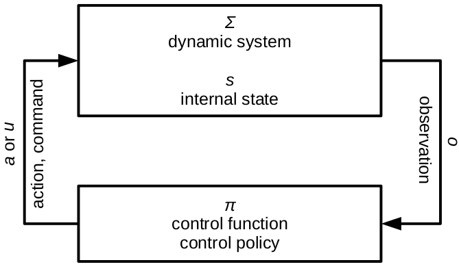

<h1 align='center'> Reinforcement learning - Introduction </h1>

L'apprentissage par enforcement est l'apprentissage du **controle de système dynamique** $\Sigma$, défini par un état qui change au cours du temps:   
A partir de l'observation $o$ de l'**état** $s$, une **fonction / politique de controle** $\pi$ va décider d'une commande $u = \pi(o)$ pour changer ou non l'état du système.

<h3 align='center'>
    
</h3>

 

Quelques exemples de problèmes de RL:
- Jouer à un jeu vidéo 
- Programmation des ascenseurs
- Conduite de bicyclette
- Pilotage de navire
- Contrôle des bioréacteurs
- Contrôle d'hélicoptères de voltige
- Programmation des départs d'aéroport
- Régulation et préservation des écosystèmes
- ...

 

Tous ces problèmes appartiennent à la même catégorie de **problèmes de contrôle** et l'apprentissage par renforcement étudie le processus d'élaboration d'une bonne **stratégie de contrôle** par le biais **d'échantillons d'interaction**.   

L'apprentissage par renforcement consiste donc à apprendre un **comportement séquentiel optimal dans un environnement donné**.

Soit:   
$\rightarrow$ Avec des pas de temps **discrets**, des **séquences d'actions**.   
$\rightarrow$ Via un **signal de récompense** pour informer de la qualité de la dernière action.

Il est important de souligner qu'aucun modèle explicite de l'environnement n'est connu a priori ; seules des interactions sous forme d'échantillons sont disponibles, ce qui guide l'adaptation du comportement du système: L'apprentissage est basé sur les données d'interaction et non sur un modèle prédéfini.

 
 

### Exemple:    

Un patient se présente dans une clinique avec son dossier médical (antécédents médicaux, radiographies, analyses sanguines, etc.). En tant que médecin, il faut rédiger une ordonnance, i.e formaliser le processus de décision concernant les éléments à inscrire sur l'ordonnance.

#### Variables des patients
Etat du patient actuel : $S_0$   
Etats futurs : $S_t$

Le dossier médical du patient permet de définir un certain nombre de variables qui caractérisent le patient actuel. Nous écrirons $S_0$ le vecteur de ces variables. Les mesures futures seront notées $S_t$.

$S_t$ est un vecteur aléatoire, prenant différentes valeurs dans un *espace de description du patient* $\mathcal{S}$ à différents pas de temps.

#### Prescription
Prescription : $\left( A_t \right)_{t\in\mathbb{N}} = (A_0, A_1, A_2, ...)$

La prescription est une série de recommandations que nous donnons au patient au cours du traitement. Il s'agit donc d'une séquence $\left( A_t \right)_{t\in\mathbb{N}} = (A_0, A_1, A_2, ...)$ de variables $A_t$.

Ces traitements $A_t$ sont eux aussi des variables aléatoires, prenant leur valeur dans un espace $\mathcal{A}$.

#### Évolution du patient

$\mathbb{P}(S_t)$?

Le patient évolue au fil du temps. Son évolution suit une certaine distribution de probabilité $\mathbb{P}(S_t)$ sur des états descriptifs.

Ainsi, $\left( S_t \right)_{t\in\mathbb{N}}$ définit un *processus aléatoire* qui décrit l'évolution du patient sous l'influence des $S_t$ et $A_t$ passés.

#### Objectif du médecin

$$J \left( \left(S_t\right)_{t\in \mathbb{N}}, \left( A_t \right)_{t\in \mathbb{N}} \right)?$$

L'objectif du médecin est d'amener le patient d'un état malsain $S_0$ à une situation saine.

Cet objectif n'est pas seulement défini par un état final du patient mais par la trajectoire complète suivie par les variables $S_t$ et $A_t$. Par exemple, il est déconseillé de prescrire un médicament qui endommage le foie du patient ou de laisser le patient ressentir trop de douleur au cours du traitement.

Un critère est définit: $J \left( \left(S_t\right)_{t\in \mathbb{N}}, \left( A_t \right)_{t\in \mathbb{N}} \right)$ qui permet de quantifier la qualité d'une trajectoire dans l'espace conjoint $\mathcal{S}\times \mathcal{A}$.

 

#### Synthèse

- État du patient $S_t$, variable aléatoire,
- Consigne du médecin $A_t$, variable aléatoire,
- Prescription $\left( A_t \right)_{t\in\mathbb{N}}$, séquence de variables aléatoires, processus aléatoire
- Evolution du patient $\mathbb{P}(S_t)$,
- Trajectoire de l'état du patient $\left( S_t \right)_{t\in\mathbb{N}}$, processus aléatoire,
- Trajectoire complète du patient $\left( S_t, A_t \right)_{t\in\mathbb{N}}$, processus aléatoire,
- Valeur d'une trajectoire $J \left( \left(S_t, A_t \right)_{t\in \mathbb{N}} \right)$.

Il semble raisonnable que la recommandation du médecin $\mathbb{P}(A_t)$ à l'étape $t$ dépende des états $\left(S_0, \ldots, S_t\right)$ observés précédemment et des traitements recommandés $\left(A_0, \ldots, A_{t-1}\right)$.